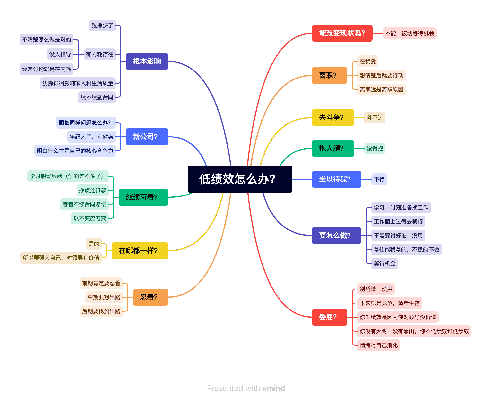

# 职场总结
## 职场修行
* 人外有人，天外有天
* 空杯心态
* 遵守行业规则
* PPT水平升级
* 站的高望的远
* 猎头是把双刃剑（自身有价值才会有猎头青睐）
* 该低调的要低调，该高调的要高调
* 遵守公司内的规章制度
* 自己手上负责的东西凸显自己在组内的重要性
* 近水楼台先得月
* 天下没有不散的筵席
* 都是混口饭吃
* 职场里都是情商的较量
* **积攒行业影响力**
* 在某方面持续积累和坚持就够了
* 需要有款产品，然后使这个产品受欢迎
* 开源项目代码贡献者，自研项目创始者，高Star
* 别拿平台当本事
* 每个人都在各司其职
* **述职评审很重要**
* **善于观察**
* 听直属领导的
* 需求评审后在着手做
* 不能只局限自己那的一块
* 在做什么工作内容，能做什么工作内容
* 代码再牛逼又如何，还不是在搬砖
* 构建核心竞争力
* 和自己比较，自己的薪资待遇要提高，然后观察同行业平均水平
* 学习技术等
* 学会拒绝，别啥都拦自己身上，那样会累死自己，还不讨好
* 离职会被背低绩效
* 过往绩效对回流有影响，如果想回流老公司，需要保护过往绩效
* 向钱看齐？
* 沉淀自己，打造自己的影响力
* 职级很重要
* 聚焦
* 初入职：少说，多做，少争执，沉住气，能忍，别爆发
* 冲动时，不要说话
* 别人都在关注你的一言一行，所以要注意细节，言辞
* 虚心接受别人的批评
* 工作中别太冲
* 工作留记录，聊天留记录，截图等，方便出问题时拿出来
* **提高自身竞争力是根本，人来人往，组来组往很平常**
* 提高自己，一骑绝尘
* 都是过客，轻装上阵
* 出勤等占比特大，所以出现很多卷人
* 同事之间是没有感情的，更多是合作，是大树的枝叶，随时漂流
* 职场无情，都是利益
* 困难时要抱团取暖
* 平时的工作内容一定要记录下来，方便review和后面简历
* 背后捅刀子的人不少，特别领导层更会隐藏杀机
* 心狠才能在职场站住脚
* 有些人只是表面客气，背地里坏得很，职场都是利益关系
* 枪打出头鸟，伴君如伴虎
* 表现不成熟是职场死忌，被欺负就是你
* 技术人干不过能说会道的，就会被架空驱逐
* 绩效的思想
* 裁人的思想
* 向上管理的思想
* 向下管理的思想
* 卷赢的获胜，提高自身是王道，投资谁不如投资自己
* **自学能力，从比自己强的人身上学习**
* 装孙子的人吃香，枪打出头鸟
* 融入团队，需要积极交流沟通
* 顾好自己
* 优先做自己能有技术提高的工作内容
* 技术分享时的词汇：如果有遗漏的或说的不对的地方，欢迎补充或纠正
* 平时不要说自己不足的地方，或者做的不好的地方，不要贬低自己，要抬高自己
* 话要少说，不利于自己的话要少说
* 是求收入增长，还是求稳定
* 自己的行为举止，别人看在眼里，记在心里
* 注意言辞，保持距离
* 注意职位，毕竟是职场
* 谨言慎行
* 表现适度，注意场合
* 注意情绪，勿争吵
* 学会宣传，学会凸显
* 学会汇报，向上管理
* 职场是人情世故场
* 好好想想自己应该做什么，哪些是真正对自己有利的，或者说是**直接受益**的，注意别跑偏了
* 事情落实与否不重要，事情吹出去很重要
* 每个人都是演员，做好表演
* 做领导支持的事
* 学会汇报，时不时汇报工作
* 合适的场合汇报
* 注意找准人，跟对人
* 成为嫡系，往嫡系爬，往上爬
* 邮件中，邀功
* 落实到文档利于晋升
* 冲突时，多思考解决办法
* 为领导排忧解难，增加自身硬实力
* 直接有利的工作内容
* 关系比技术重要
* 站队，自己人思想
* 对人多用敬称
* 评级晋升很关键，官高一级压死人
* 做直接有利的内容
* 升职加薪为根本
* 多和领导套近乎
* 多汇报手上的工作和进度
* 多方面凸显出自己，但要控制好度
* 说话平和，慢和停顿
* 不要争执，争执时不说话就好
* 关系是变化的，人也是变化的
* 关系是不可靠的，可能今天很好，明天就不好了
* 提高自身的能力是关键
* 发言前一定三思
* 切勿喧宾夺主
* 职场差别在信息差
* 职场差别在不同位置，信息不透明
* 职场并不友好，明争暗斗很普遍
* 合适的时候说合适的话
* 搞关系者在上位，说明关系比能力重要
* 别陷入内斗中，更别把精力花在搞关系上，花在提高自己身上
* 技术不是全部，关系对于晋升更重要
* 职场使用6分力量，全力容易后劲不足，让人感觉不卖力啥的
* 关系是最不可靠的，也是瞬息万变的
* 有时间精力，多提高自己
* 合适的时间，合适的场合，说合适的话
* 自己的成果不要轻易显示，不然就很容易成别人汇报的成果
* 先私下沟通，然后再发正式邮件或者拉群
* 拉群需慎重
* 人分三六九等，职级也分三六九等
* 谨言慎行
* 对自己有利的事做，无利的事不做
* 示弱可以从别人身上学到东西
* 强势容易失去一些机会
* 喜怒不形于色是本事
* PPT要熟练，也是汇报的关键
* 不要多管闲事
* 不是自己的工作不要瞎掺和也不要瞎操心
* 先把自己分内的事做好，再考虑其他
* 多听少说
* 不争辩，没意义
* 人家叫老师只是客气，别当真
* 做某件事前，先想想做这件事成熟不成熟，不成熟的事不做
* 技术重要吗？技术没想象的重要，挣到的真金白银更重要
* 做成年人该做的事，做成熟的事，成熟做事
* 工作活儿的重要性就表示人的重要性
* 头脑要灵活，做事前考虑是否对自己有利
* 活儿的重要性体现的人的重要性
* 静待观察，等待机会，等待别人矛盾爆发
* 技术再好也是干活的，往管理走，更考验的是综合能力
* 构建自己的核心竞争力，只自己知道和掌握的
* 不要给人有野心的感觉，要给可掌控的感觉
* 人外有人天外有天
* 理解别人问问题的背后含义
* 技术是学不完的，学直接有利的内容，不止于技术，包括人际交往
* 人家问了再说缺点，人家不问不说
* 不做不成熟的事情
* 切勿夸夸其谈，只要平稳语速语量
* 思考别人为什么这么做，分析别人的行为
* 说话时不要有情绪，没有情绪说话，有情绪别人会以为你幸灾乐祸
* 职场没朋友
* 职场人是资本家的牛马
* 上班为了挣钱，其他的都是假的
* 领导的承诺等听听就好别当真
* 不要全力以赴，要保留体力，最多使70%的力量
* 充实自己，提高自己是根本
* 做对自己直接有利的事
* 要有防备心
* 职场是竞争关系
* 不要在职场说个人的任何信息
* 职场是名利场
* 要低调，不要有锋芒
* 不要不服，也不要显现出来
* 不要喧宾夺主，不要抢了主人的风头
* 职场是个利益场，没有朋友
* 在职场做个聪明人，别被人当枪使
* 察言观色，少说话
* 裁员会成家常便饭，看淡看透
* 别看不惯这那的，看不惯这那的都是不成熟的表现
* 有些话听听就得，事缓则圆
* 有些事让别人出头，自己不出头
* 别自己扛事，让别人扛
* 做事前，想想这事怎么做合适
* 有些话听听就得，别当真
* 学会睁眼说瞎话
* 没准备好时，不要点开别人发过来的消息
* 一条链路上的一丘之貉
* 给别人东西前，一定要确保东西没坏
* 多人在场的时候，不要分发东西
* 给别人吃的东西要慎重
* 一条利益链上的人能不知道彼此的问题么，大家都默契的不拆穿罢了
* 不要秒回信息，等别人发完再说
* 装听不见是种智慧
* 只说事，不评论，不提别人出主意，做决定等
* 说话后不要加"哈"等语气词，语气词表现不成熟
* 在职场中，要如履薄冰的活下去
* 领导乐见员工互卷内斗，好坐收渔利
* 任何说的，发的话，都要三思其背后的潜在含义，别让人误会
* 人就是劳动力
* 别替领导做决定
* 表里不一是当领导的入门功夫
* 当表子立牌坊，不喜欢下属拍马屁，自己却是拍马屁上去的
* 出问题时，领导不会觉得是自己的问题，会把责任甩给下属
* 职场是逢场作戏，草台班子
* 等别人犯错，就是自己的机会
* 学会在职场生存下去
* 解决领导遇到的问题，凸显人的重要
* 群里说话和私聊说话是不一样的，都要更慎重
* 不要威胁任何人，特别是领导
* 职场培养的是奴性
* 职场是交换，是利益，
* 领导的必修课，没有人情味
* 一个人的精气神和能量是有限的，别散了
* 同事的电话，不是紧要的不要回过去，准没好事
* 躲在后面，不要冲在前面
* 大晚上，一般不要接电话，准没什么好事
* 不接话，出错的都是干活的
* 语言的威力太大了，一定思考后在说话
* 站位不同，关注的事不同
* 角度不同，看事情的紧急程度也不一样
* 多用他们说，少用我说
* 嘴上不要说"不知道"
*
* 同事或领导喜欢：明知故问
* 不好的事用积极的词汇：动员
* 下面小组长做的事都是上面领导默认可的，默许的
* 高级领导知道低级领导排除异己，默许而已
* 高级领导知道低级领导的手段，高级领导就是那么过来的
* 跟领导说话最好留言形式，特别是催领导的事，表达对方催的，不是自己催
* 部门之间是相互背锅的关系
* 人与人是不平等的，绝对不平等
* 高级领导是一言堂，有权利，员工需要关注领导喜好
* 活儿是干活的干的，锅是干活的背的
* 职场不需要树立热心人设，热心容易吃亏，以自己利益为重，利己
* 少说话，少打字，越多越错
* 甩锅能力要增强
* 语言的威力巨大
* 结论后的结果，不要再去找和提异议，已经定死了，别给自己揽活
* 不要过多找领导汇报和遇到的困难，领导会觉得你能力不行，报喜不报忧，坏事不要找领导汇报，除非实在顶不住了
* 不要和领导走得近，远近要适当，伴君如伴虎，太远也不行，适当就可以
* 人是会变化了，特别是升职之后，不在是从前的同事关系，而是上下级关系，要注意分寸
* 谨防卸磨杀驴，要保留核心竞争力
* 说话的时候，不要说我说，要说他们说的
* 职场没有朋友，只有利益
* 不要被某些人善良表面迷惑，是陷阱
* 等别人说完话，再挂断电话，不然会让人感觉鲁莽，不稳重
* 多观察、少说话
* 偷偷充实自己，自己的东西不要去显摆，看到机会抓住机会
* 别人只关注自己组内的利益或者自己的利益，不会做和利益无关的事情
* 有些人享受支配别人的权利
* 越高层的领导越天天开会
* 低层次的东西不要总挂在嘴边
* 不要站在自己的思维看待事务，而是站在领导的思维看待事务
* 熟能生巧，做任何事都一样
* 不积跬步无以至千里
* 领导只会对外部门说好话，然后苛刻内部人
* 测试关注A，领导关注B，自己关注C，自己的优先级一定是C
* 领导都是不负责任、趋利避害、压榨员工、卸磨杀驴
* 防范同事和领导，防范小人，防范笑面虎
* 飞鸟尽，良弓藏；狡兔死，走狗烹
* 没有了利用价值，就会被无情抛弃，职场是没有交情
* 感情牌没有用，不如买点东西实际
* 小人都会打小报告
* 遇到难题，不要亮自己底牌，不要问自己的同事，多问和自己没有工作交集的人，多问没有利益冲突的人，向外部求援，别向内部求援
* 有些事不要图捷径
* 职场是圈子和团伙、帮派
* 技术不重要，越来越没价值了，职场混的是圈子
* 事情是把双刃剑，好了大家都好，坏了谁提出的谁背锅
* 人都是趋利避害的
* 人可以有野心，但是不要表现出来，有野心不能贪心，不要随便挂名
* 遇到挂名事情时，第一个往出推，第二个表现没野心
* 领导喜欢挖坑，小心上当,不小心，怎么死的都不知道
* 职场人很坏
* 别吃信息差的亏
* 没有爬上去之前人是很被动的，被动就要挨打
* 只要做事了就会有漏洞，就会被找出毛病，就有被人攻击的理由
* 最终解释权在领导那
* 人是不平等的，地位也不平等，不公平是社会的常态
* 人微言轻
* 人首先想到的是推卸责任
* 想在职场生存，要保护好自己
* 一句话能说清楚的不要分开两句说
* 组织好语言再发，不要来回撤回，最好不要有撤回痕迹
* 不要别人说啥就干啥，要思考后再做
* 签字就是为了出问题时背锅的
* “不好看“这个词以后不要在脑海里出现
* 多用“不合适吧“”，不用“不好看”
* 回复时，对于不知道怎么回复时，不说话，因为不管怎么说都会错，不说话是最好的方案
* 可以装没听见，做任何事之前一定要思考，不是别人说啥是啥
* 说话要慢，说话要思考
* 不要着急回复，语速慢的人都是在思考怎么说话，而不是表面的刻意慢说
* 和直属领导一定弄好关系，别有误会
* 有时候什么都不做比做好，因为只要是做，就可能做错
* 以不变应万变，镇定观察
* 什么都不说，什么都不做就是万能解，因为说什么，做什么，总是能被找出漏洞，进而被人攻击
* 给领导报喜不报忧
* 群里发言的目的是让领导知道，既然领导已经知道，就不需要再在群里发言了
* 职场要学会保护自己，自己不要出头
* 多听少说，注意不同词汇的区别，语言的威力很大，要提高语言理解能力，提高说话的技巧
* 提高语言理解能力，要语言用好
* 不同部门之间是竞争关系，不刷高层的脸，事是办不了的，相当于给面子
* 国企做事喜欢留痕，特别是邮件，企业微信次之，为的是出问题时有人担责，所以人都是冷漠的，不是讲情面的地方
* 不按规章制度办事，人就得走人，高层内斗，都希望把对手弄走
* 国企也没有交情，只有拿钱办事，保护自己的同事，把责任甩出去
* 站的越高表面上程承的责任越重，实际承担责任的都是底下干活的
* 领导喜欢员工内斗，斗败的都是潜在淘汰选手，人在领导眼里就是牛马
* 有人出头时，自己不要出头，。对于不好的事，有人私底下和领导说了，自己就不要再说了，会把矛头指向自己
* 语气和措辞在说话时一定注意，不同的语气，不同的措辞，效果是不一样的
* 不管用什么招，只要结果对自己好，那就可以用
* 肢体语言也很关键，少用肢体语言，会显得不成熟，不要有多动症
* 合适的时候可以眼神交流，不知道眼睛放哪里时低头就行，低头有认错的意思，不用东张西望，人家会觉得你不尊重他
* 有时会被别人树典型，不要说话和吱声，沉默不说话是最好的解决方案，因为越反抗越被打击
* 不说话可以大事化小小事化了，领导说话时不要插嘴，也不要发表看法
* 多干多错，少干少错，不干不错
* 领导找你谈话，不是商量，是通知，是命令
* 不要直接去找大领导，相当于跨级，对自己没好处
* 人微言轻，自己说话没分量，让他们去说
* 职场玩明白潜在规则，就不会那么被动
* 不好的事私聊，越少人知道越好，好事发群里
* 不要着急说话和回复，不要急，要深度思考后再回复
* 不要接话，特别是群里，人多眼杂
* 不回复信息也是一种回复，表达了一种态度
* 已读不回很常见，没必要玻璃心
* 多问和自己没有工作交集的同事，不在同组同事中问低级问题
* 企业微信不点开就是相当于没看，对自己是种保护，点开准没好事
* 邮件为留痕，背责常用手段，还有手写签字
* 做有产出的事，没产出的事尽量避开
* 事情有重要和不重要之分，做好重要的事
* 不要直接找大领导，大忌
* 不要说不知道，不要提困难，不要给领导提建议
* 捧别人的时候别贬低自己，任何时候别贬低自己
* 别在别人眼前晃悠，人家会觉得你闲
* 职场要做表面老实，内心聪明的人
* 不要欠人情，人情难还，也不要贪小便宜，
* 做把责任甩出去的事
* 不要参与面试当面试官，没好事，面的话也要从中学到东西
* 不知道怎么回答时就先不回答，装没看见，知道了怎么回答后再说
* 三个女人一台戏
* 金字塔原理，职场和生活一样，都是金字塔
* 装不知道，没听见没看见是种智慧
* 提高遇到事处理事的能力，不是说技术上的事
* 不说不知道，说不太了解
* 职场和生活都需要贵人
* 周旋，斡旋，被夹中间处理事情的能力
* 不要有撤回痕迹，显得不稳重，也会让人联想到之前不好的事
* 领导有些话是随意说的，不要当真和重复，只附和回复就可以了
* 要挑出话语的重点，然后针对性的回复
* 文字了力量很强大，不只语言力量大
* 表达对领导的感谢和欢迎"谢谢领导关心，欢迎领导！"
* 给领导看到对自己有利的东西，要注意细节
* 领导会通过细节判断一个人的工作情况
* 什么时候留言（有记录），什么时候打电话（有录音），什么时候打语音（无录音）要分清楚
* 不回复准确信息，含糊回复，别被别人卖了还不自知
* 不要说自己的想法，要说别人的意思，不是自己的意思
* 不要说太多东西，不知道怎么回复时不吱声
* 别人提的每个问题都有坑的，要防范，要找挡箭牌，提自己挡伤害的
* 不回复也是一种回复，记住
* 问人家"为啥会打听这个"，知道别人啥意思后，在定怎么回复（先知道别人的意思再看怎么回复）
* 能装听不见就听不见，要分析出弦外音
* 聪明人：回复含糊的词汇或者不回复
* 不让别人从自身获得利益或好处
* 说对自己有利的，不说对自己无利的
* 听别人说话，了解更多东西，传话时要挑拣着说，挑对自己有利的说
* 有些问题正面回答和反面回答都不好，最好的方案就是不吱声，装没听见，或低下头不吱声
* 不要为了赶时间和同事照面，不是啥好事，而且会被透露个人信息
* 以后话别说太满，和领导汇报时要给自己留空间，要把问题点牵引到别人，说是别人和我反馈的，我再和您反馈的
* 不主动找领导汇报不好的消息，让别人去找
* 职场太恶心了，白天说的好好的，晚上就可能被捅一刀，任何人都不可信
* 邮件要注意措辞，把别人带上，说是别人和我说的，我跟领导汇报的内容是别人说的
* 电脑桌面一定要是工作相关的内容，因为不知道啥时候就有同事或领导过来萨摩
* 部门之间是竞争关系，不是合作关系，有些部门的人真是变态到令人发指，有病且病的很严重
* 评价别人时，有明褒暗贬手法
* 针对不同性格的同事，要有不同的应对策略，要灵活
* 领导的话不可信，听听就好，随时会变化，随时会打下属个措手不及
* 装听不见是种智慧，下级喊上级过来不合适，所以上级有时会假装听不见
* 说话沉稳，不紧不慢，给人踏实稳重的感觉
* 不要关心别人的事，只关心自己的事，时间只花在自己的事上，时间不花在别人身上
* 时间就是金钱，所以时间不要花在别人身上
* 职场是竞争关系，你不争，有人争，你不表现，有人表现
* 说事时把别人带上，说是别人的意思，不是自己的意思，把自己从事中摘出去
* 做任何事之前一定要先动脑，思考要不要做这件事，怎么做这件事，自己做这件事合适不合适
* 想领导反馈东西后，领导会给一个指示，每个指示都是一个新活，所以反馈的次数和时机很重要，过多就是给自己多揽活
* 有些人知道系统或公司问题所在，他们不提出来不是他们看不见，而是聪明的地方，谁提出来谁倒霉
* 有些事只能心里知道，但是不能说出来，说出来就要付出很大的代价
* 自己得成长起来，强大起来，不依靠任何人
* 转移话题
* 转移主题，往别人身上引，不说自己的事
* 主语一定是别人说，不是自己说，引用的别人的话
* 自己别出头，让别人出头，自己躲后面才安全
* 不要给领导出注意让他怎么做，领导自己知道要怎么做
* 不替领导做决定，领导有自己的看法，自己要有自知之明
* 有些话回复也不是，不回复也不是，不动作是最好的
* 以不变应万变
* 职场都是团伙，有些信息只有团伙内人知道，都是防备状态
* 做任何事前，都是先隐藏动作，事成了才通知的
* 做事时大张旗鼓，事肯定干不成
* 国企嫡系分的特别清楚，谁是谁的人，哪些信息能和哪些人说啥的
* 职场要藏住秘密，好多事都是私底下定好的
* 职场跟对人很重要，跟对人就会平步青云
* 没人带领的情况下，靠自己是很难出头的
* 职场人能力都差不多，比的是人际交往，是否站对队
* 领导处理的事都是跟各方周旋的活，而不是具体的某个活
* 要给人可靠，可委以重任，值得相信的感觉
* 职场能力不是第一位的，衷心、听话才是第一位的
* 培养独立思考的能力
* 先自己思考解决办法，自己解决不了，再寻求别人帮助
* 有些人知道某些事，不告诉自己是正常的，人与人之间的差距来自信息差
* 职场保持距离，保持神秘，别人才不敢惹
* 把话说含糊是种智慧，让别人抓不住把柄
* 什么时候当面聊，什么时候留言聊，都是有讲究的
* 不要在意和自己无关的事，在意和自己利益有关的事
* 随手、随嘴带"谢谢"字样，嘴甜无坏处
* 组织语言好后再说，把关键点说出来，语言要包装
* 摆正自己的位置，不操心别人的事
* 事缓则圆
* 任何能爬上去的人都不简单
* 领导喜欢用下马威的方式震慑手下的人，也会杀鸡儆猴，敲打一些人给另一些人看
* 自己的敏感信息及时关闭，别让任何人看到，涉及别人的敏感信息也要及时关闭
* 稳，不急，不慌，淡定，沉稳
* 不要提任何建议，对自己没有好处
* 职场以退为进
* 人微言轻，没到一定位置，就要蛰伏
* 当领导的人，一般都会讲故事，讲所谓的历史
* 正式的留言要有"。"句号
* 稳的时候不用动脚，站在原地就可以
* 领导常用词汇：思路和打法
* 有些话听听就行，有些话要认真听，要听出哪些话是真话，哪些话是假话
* 会跑马屁是种智慧，看别人的言语，从别人身上学习
* 有时候没必要打招呼，没必要问候"早上好"
* 下班点后，隔壁部门的事项不是紧急的可以企业微信"不读"，因为已经是下班时间
* 带上原邮件的好处是，原邮件的人也可以帮忙解答问题
* 职场就不是平等的，要区分哪些是牛马活，哪些是升职活
* 部门内和部门外的处理事项是不一样的，处理方式也不同，优先部门内的事务，认清大小王
* 职场就是斗争，今天你在上位，没准明天你的下属就成了你的领导
* 职场别自作多情，别自以为是，要咨询领导的想法，领导的想法和自己的想法不太一样
* 别人给自己发邮件，抄送自己领导，相当于打自己小报告
* 职场年龄不重要、工作年限不重要，对领导口味才重要，不要倚老卖老，要学会蛰伏，等别人犯错误
* 自己的下属没准哪天和自己平起平坐，没准哪天成为自己的上司，要学会适应和改变，平时做人留一线
* 职级的不对等造成行为的不对等，看事看门道，对不同的人，对同件事的行为是不一样的
* 为啥有人想邮件，表示留痕用，都是让人背锅的手段
* 人在屋檐下，得看清形势
* 别矫情，学会拒绝，学会婉转的拒绝，别麻烦组内人，别麻烦部门内的人
* 不分析职场行为，怎么死的都不知道
* 别人没问起，不要主动冒头
* 不要着急回复信息，因为别人可能还没发完信息，等别人完全发完信息后再回复
* 一个完整的事一句话说完最好，而且要有标点符号，看着正式正规
* 敌人的敌人是朋友
* 职场要有交付物，要留痕，对自己是种保护
* 别过多说话，别把责任揽到自己身上
* 遇到问题，自己不说看法，让别人说看法，让别人排查
* 压抑怒火，有些同事真的是SB，不要和SB一般见识，免得惹得一身骚
* 话最好说的含糊，这样即使出问题也没有关系
* 工作时间发东西，别人才知道是谁发的
* 要小心"以猫为工作头像的"女人，她们心眼小，还喜欢搞事情
* 要思考哪些事要自己出面，哪些事自己不能出面
* 职场没有朋友，没有交情，只有利益和竞争关系，要保护自己，要喜怒不形于色
* 职场小人特别多，注意甄别和防范，和小人保持距离，不要有交集
* 职场两面派也很多，当面一套背后一套，要防范
* 在职场生存要有智慧
* 角度不同，关注的事是不同的，站位不同，关注点也不同
* 组内女人多，是非就多，要远离女人多的组
* 技术好都是干活的，看出是牛马，还是监工
* 任何系统的最终目的都是为了服务客户，为了利益，职场的本质是为了钱
* 研究职场，研究人
* 职场别露怯，别矫情，别玻璃心，别看不惯，别扭捏，别话多，别谈心，别多嘴，别出头
* 不要肢体动作过多，尽量不要有肢体动作，显得不成熟
* 话少是一个人成熟的标志，祸从口出
* 做一天和尚撞一天钟
* 一句话把事情说清楚，别分开，分开后别人从单句中不能理解你想说啥事
* 有时候拉上自己只是为了会议时充人数，不必太在意，但是要少说话
* 指导别人有诀窍，不主动，不核心，不多说
* 说谎是职场的必修课
* 别人不急，自己也不要急，急容易内耗，内耗别人，别内耗自己
* 职场工作要自保，谨防卸磨杀驴
* 职场提"技术"名词太弱爆了，职场其他能力更重要
* 不要露怯，不要有情绪和表情，深藏不露，泰然自若
* 职场中做老好人，不得罪人，左右逢源，见人说人话，见鬼说鬼话
* 别成职场小白兔，要做狐狸
* 解释只会越描越黑，别人还会觉得是挑战他的权威，闭嘴不说话是最好的
* 回答含糊是种智慧，因为别人的提问很可能是有目的的
* 让人感受到有改变，有成长，蛰伏等待机会，别咋咋呼呼的
* 甩开责任
* 看到消息时，别立即回应，要分析有没有坑，再做考虑
* 职场要有竞争意识，也要有坐收渔翁之利的意识
* 两虎相争，必有一伤，坐收渔利
* 得罪人的话不要说，不一定啥时候就被弄，风水轮流转
* 别图一时嘴痛快，后患无穷
* 领导不关心谁给他干活，重要的是有人给他干活
* 和领导报喜不报忧，注意的汇报时机和向谁汇报
* 哪些方面是支出，哪些方面是收入，领导层看的很清楚
* 领导有权力，没权力就不叫领导了，有权力是好事情
* 模仿阶段、思考阶段、超越阶段
* 很多事情是相互的，注意力度，力度大危险大，力度小没效果，力度要适中
* 不要存在这种思想"牛马做习惯了，不做牛马还不自在了"，要摆脱牛马标签
* 在任何一个环境，都要夹着尾巴做人，不可冒头
* 有些鸡汤读读听听就得了，没必要上心
* 透过现象看本质，透过表层语言看深层含义
* 人外有人天外有天
* 三思三思再三思后做事
* 有些人是摇钱树，有些人是无底洞，有些人是牛马，有些人是可弃品
* 别随便答应别人任何事，也别生硬拒绝，处理这种事要灵活
* 文字表述要有标点符号，严谨
* 人是一个能量体，不要随意散发能量
* 职场要学的太多，人精太多，要学会保护自己
* 有人装病、有人装出去、有人装傻、有人装B、有人大智若愚
* 不要说话，也不要接话，接话后冒头就会指向自己
* 职场上有一堆为了上位不择手段的SB，保持距离
* 别笑，别有任何情绪，面无表情是成熟的表现，表里不一也是成熟的表现
* 不要看不惯不公平，职场就没有公平，接受这些不公平是成熟的表现
* 换位思考问题，持续成长
* 话别说满，含糊是基本功
* 任何人都是靠不住的，职场从来没有朋友，只有利益
* 事缓则圆
* 什么事情私聊，什么事情发群里，是有讲究的
* 无情绪，无抱怨
* 别人的事和自己没有任何关系，只关注自己的事
* 保持低姿态才能从别人身上学到东西，才不会对别人构成威胁，别人也就不会防备你
* 有权力就可以指使别人干活
* 不动就不会出错
* 职场是人际关系，说不上就啥时候需要别人帮忙，别得罪任何人
* 人分三六九等，从来都是金字塔结构
* 天塌下来有高个的顶着，自己不要出头
* 先了解别人问问题的目标，再根据目的情况做回答
* 防范别人的捧杀手段，小人的行径
* 明天的事明天再说，不要在今天纠结，影响今天的情绪
* 做人要有城府，要深藏不露
* 人的价值就是从各种事上体现的
* 躲在后面最安全，最能坐收渔利
* 分清哪些是重要的事，哪些事不重要
* 1、不要失业，2、不要高负债（最好没有负债），3、不要想着一口吃个胖子，4、要有风险意识
* 职场老油条很多，他们做事喜欢磨蹭和观望
* 领导常用的手段是卸磨杀驴，当一个人无利用价值后就会被抛弃
* 谁往出分活，谁默认是领导，这是职场潜规则
* 谨防职场老狐狸，和这种人也要少接触
* 吃饭等路上要躲着认识人，尽量少接触认识人，不会有好事，只有坏事
* 不要话多，言多必失
* 在职场不要大声，也不要大声笑，很不成熟的表现
* 发邮箱时，把别人带上，表示不是自己的意思，是别人的意思
* 领导引导下属做事的原因是领导想撇清责任，看着决定是下属自己下的
* 有些东西能不动就不动，动了也不见得有好，出问题了问题就大了
* 可以迂回做事，先答应后想办法后再不答应
* 站的角度不同，同件事的关注点不一样，行为也不一样
* 能爬上去的人不简单，和他们打交道要格外注意
* 好多部门为了找存在感，开始找事情
* 不同的群的发的信息可能不同，发之前要审核好
* 遇到分歧时不说话，看别人的意思
* 做事要灵活，要动脑，啥时发言，啥时不发言，什么场合说什么话
* 人多的场合不要发言，不要当出头鸟
* 做某事有疑问时可以先不动作，不动作就不会错，有动作就有错的风险
* 有些问题你想到了，别人也有想到的，但别人不说，谁说就是拿谁当挡箭牌了
* 不要质疑领导们下发的工作内容，没有好果子吃
* 不要当出头鸟，不要提建议，有事私下聊
* 有些会上，别人问你想法，不是想真的知道你的想法
* 职场自保第一条：不要在会上出头
* 得罪人的事要灵活处理，谁也不会出头保谁，职场得学会自保
* 你的疑问别人不关心，也不会关注，大家都是装模作样的做事，没人在意细节，只在意把事情交代下去
* 说的含糊可保命
* 公司同事都是表面关系，私下里没准都是男盗女娼，做些见不得人的勾当
* 好多事不要自己出头，让别人出头
* 发信息之前要准备草稿，组织好语言再发送，特别是发群里的信息，更要字斟句酌
* 表达字越少的事越多风险，领导喜欢说的模糊，表达的少，风险都被下面承担了
* 多请示，少做主
* 摆脱不成熟的印象和行为
* 话要抻着说，不要直接亮底牌，别人逼的没办法了才能考虑亮底牌
* 出问题时，把别人推出去
* 什么时候用电话、邮件、企微留言等是需要技巧的
* 表现是把双刃剑，没出问题皆大欢喜，出问题就得有人背锅
* 出问题后，别在别人面前晃悠
* 要有甩锅的能力，左右周旋的能力
* 工作中技术已经没有那么重要的，重要的是语言的艺术，文字的艺术
* 不管是谁的问题，不管是不是你的责任，只要是用你名字提交的，就和你有脱不了的干系
* 上上级领导对上级领导也没有交情，说驳回就驳回内容，不会顾及情面，没有交情
* 没啥重要事，别主动找别人，别人只会觉得你给他找麻烦
* 出事了，领导都会甩锅，躲得远远的，都干活的背锅
* 出问题了，上级不会护着，而是躲着，切记，职场要保护好自己
* 汇报时绝对主意词汇，不要把问题隐含到自己身上，而应该隐含到别人身上
* 说话不要画蛇添足，文字也不要画蛇添足，话多就会漏洞多，就会被别人抓住把柄
* 当官之后，什么荣誉、钱啥的都来了
* 别人不管你系统的死活，别人只管别人能交差
* 职场没有道理可讲的，底层就是背锅的命，不可能拿上层开刀
* 真相不重要，职级重要，职级在高位，错的也是对的，职级在低位，对的也是错的
* 好多事情都是双刃剑，有利有弊
* 有些事要按别人安排的来，有些事要灵活应对，别人安排的很可能有坑
* 词与词的含义有微妙区别，需要识别其区别
* 文案特别重要
* 都是老油条，他们比较喜欢做事拖拉（事对他们来说没产出）和观望
* 世界上好人多是伪命题
* 人人平等也是伪命题
* 不要话多，话多错多，别画蛇添足，话多显得不稳重
* 不要自作聪明，你想到的问题，别人也会想到，特别是来的时间比较久的
* 事儿拖着拖着就没影了，事解决不了就拖，事怎么办都不合适的时候就拖
* 职场要学会见招拆招，博弈
* 职场中不要点名，不要透露个人信息
* 不要随便进群，进群有默认属性
* 
*
*
*
* 把精力发在别的事情（不是技术上）上的人更吃香
* 职场上要给人感觉人畜无害，自己不要出牌，不要让别人知道自己底细
* 语言艺术和文字艺术
* 话说出来是让人舒服的，不是得罪人的
* 留下来的基本都是人精，你靠近别人，别人就会觉得你有所图
* 职场中不存在闲聊
* 人际关系是伪命题，本身是利益关系
* 职级低是原罪，是被欺负的角色，要摆脱现状
* 天塌下来有高个的顶着，自己不要做出头鸟
* "感谢"和"谢谢"是有区别的，多用"感谢"
* 发送邮件时，一定要注意邮件的引用关系
* 没分析清楚不用动作
* 职场要沉淀
* 不知道啥风向，不要轻易搭话，听着就好，覆水难收的道理，祸从口出
* 身上存在分析的慢，分析的不透彻的问题
* 不该说的不能说
* 不想去就说外在因素，不要说自己不想去
* 分析不出利弊的时候不要说话
* 从容分析，顺其自然，服从安排
* 别倚老卖老，别把自己架上去，架上去就会摔的很重
* 不要透露个人信息，多知道对方信息
* 高层领导都是听别人对自己的评价，很少会听自己对自己的评价
* 人言可畏，谨言慎行
* 直属领导非常关键和重要
* 道行不够要练，要多思考
* 人都是干电池和牛马，分析怎么对自己有利
* 职场敏感也是双刃剑，谨小慎微容易陷入内耗
* 陈述事情，不表态，表态容易表错，给自己挖坑
* 同事之间没交情，不用太在意
* 有些东西该放弃要放弃，抓大放小，不可能啥都要到，要有取舍
* 翅膀没硬时要忍
* 谨防捧杀，要注意被人算计，被人陷害
* 立不太了解人设可以避免背责任
* 多请示少做主
* 不用心虚，职场就是有忙有闲，不会一直忙碌，也不会一直清闲，是正常的
* 发邮件时，谨慎在谨慎后再发邮件，轻易不要撤回
* 喜欢摆谱的人喜欢夹着嗓子说话，显得洪亮
* 不用喜欢每个人，喜欢RMB就行，只是在职场挣钱而已，没交情
* 什么时候回消息，隔多久的消息不能回，都是有讲究的
* 别人有事会再打来信息的，别主动上赶子问，别没事给自己找事
* 小心别人下套，小心提防
* 没想清楚时，不要正面回答别人问题
* 说自己的情况，让领导去想、去安排
* 不做出头鸟，做任何事别做出头鸟，不要做第一个（太扎眼），坏事别出头
* 脸皮要厚，不要莫不开
* 很多事情都是双刃剑，有好有坏
* 有些人不群里签到是有道理的，思考其深意
* 好事往前凑，坏事躲着点
* 吃一堑长一智
* 聪明人看到群消息不回复，等别人先回复
* 不是嫡系别在人前晃悠，人家觉得你闲
* 多思考才能在职场活得久活的远
* 保持神秘感别人才不敢欺负
* 跟大流不会错
* 别人也在成长，也在学聪明
* 同事之间都是表面和善
* 职场也是感觉，谁是谁的人，感觉好不好，别树敌，保持基本的交流即可
* 直属领导评价是最关键的
* 职场只是挣钱
* 问别人时，可以问"大家有没有问题"
* 职场有很多聪明人、老油条
* 职场多观察、少表态
* 身份不平等，同件事结果就不一样
* 职场都是看人下菜碟的，切记
* 自己的东西不要教给别人
* 不好的事情甩出去
* 让别人先出牌、先发言、先出招，真相不重要
* 头脑要灵活，反应灵敏
* 职级低被欺负是正常的
* 职场不要看年龄，看领导喜好
* 别人不会为难自己人，多成为自己人
* 解释权在领导手里
* 会上，领导发言很多时候是为了树立威信
* 保持低姿态才能学到东西
* 文档上的东西，"沟通"字样比较虚
* 不表态、不发言也是种表态
* 多问，少做主
* 做事时，多拽上几个人对自己是有好处的，出问题大家一起背
* 会上，有人帮你说话是不一样的
* 别人对你不客气时，你也不必要对他客气
* 装看不见也是种智慧
* 要尽快成熟起来，看事情要有全局观和远见
* 不要笑，职场不要笑
* 职场是斗智斗勇的过程
* 电脑上处在哪个页面非常关键，已读和未读的含义也不一样
* 不行动就不会错，做某件事总会被别人抓住辫子，因为事都是有两面的
* 语言一定要表述清楚，抄送是抄送，直发是直发，一定要注意
* 宁写少别写错，少写了一般不会被人发现，写错了就太扎眼了
* 回答别人问话时，不要给与肯定回复，要含糊回答，这样不担责
* 别给明确答复，要含糊点
* 用查看词汇"阅"等，不要发表意见，包括"好的"、"同意"
* 手别太快，等思考好后再发送信息
* 等人把话说完再回复
* 职场中，与多人周旋时要灵活，说话要注意
* 谨防别人甩东西，别人是在甩责任
* 聪明人不会去写代码，因为写就会写错，写错就会背锅
* 有些话可以回复，有些话不用回复
* 别被人卖了还在帮人数钱
* 要从别人身上学东西，不要把自己的东西教别人
* 不知道怎么说就不要说话，能保命
* 职场要成熟，周围都是豺狼虎豹，别做小白兔
* 干啥都是一辈子，干啥都是为了挣钱
* 什么时候回复，什么时候不回复要思考，让别人欠你人情也很重要，不要让人觉得你可以被随意使唤
* 更重要的提醒放在前面，让人第一眼看到
* 有些人说话说的含糊其实是故意的，是老油条和聪明人
* 活凸显了人的重要。做事有油头，才顺理成章
* 不要乱说话，考虑好利弊，分析利弊
* 人的认知在变化和成熟，做事跟人的认知有关，跟时间节点也有关系
* 急性子不好，别得罪小人，别得罪领导
* 远离嫉恶如仇的人，领导都是嫉恶如仇，睚眦必报，心狠手辣的
* 别想在某家公司躺平，人在成才，认知是一个阶段一个样
* 能在职场上混的人都是人精
* 自视清高融入不了社会（表现看不惯，某事不屑于做）
* 抓小偷，得比小偷更聪明，同理，想不被别人欺负就要比别人更心狠
* 很多地是围城，可能出了狼窝又入虎口
* 职场讲利弊，分析利大还是弊端大
* 让对方多说，让对方多介绍介绍，自己少说或不说
* 职场看的的领导喜好，人际关系（利益关系）就说的喜好
* 人在屋檐下不得不低头
* 不要实事求是
* 看人下菜碟，见人说人话见鬼说鬼话
* 职场得忍，对错不重要，绩效是核心，挣多少钱是核心
* 人际关系，利益关系，帮领导解决问题，而不是制造问题
* 没人会去伸张正义，不要靠职场任何人
* 出现一把好牌打稀烂的情况要反思，学会闭嘴
* 说话要慎重，想不明白时反问
* 别人也在成长，嘴也严了
* 反应要快，要灵活
* 职场中是信息交换，没有闲聊，一起吃午饭也不是闲聊
* 被打压在职场是稀松平常的事
* 都是成年人别矫情，也不能让领导觉得你矫情
* 在职场中想找人伸张正义太可笑了
* 打架没干过人家，领导觉得你怂货
* 职场如战场，直属领导的评价就决定了在职场的发展
* 对自己不利的事不要做
* 别暴露自己的短板（邮件、文字、说话等方面）
* 别把自己做的不利的事暴露给别人
* 任何人的任何话都不要轻信，要有脑子
* 任何表述要表达自己工作了
* 多用督办（催办和督办有本质区别）
* 在职场生存是斗智斗勇的过程，要识别别人挖的坑，要在多人中周旋
* 明白文字的含义，以及文字之间的区别
* 发的邮件内容和排序，就能知道人员的位置和重要程度
* 有些事可以先回复"好的"，然后回去后再思考怎么更好回复
* 在职场要学会生存
* 别做傻傻的拉磨的驴
* 不防着别人容易被人玩死
* 职场没交情，也没感情，只有雇佣关系和被雇佣关系，别矫情
* 你看到的是别人想让你看到的，自古以来都是如此
* 不确定性是一直存在的，学会坦然接受
* 不提技术，技术在工作中一文不值，干不过搞政治的搞管理的
* 职场混的不错的都是人精，知道就行，别拆穿
* 做事原则：不做得罪人的事，人缘就不会差，得罪人的事躲远远的
* 人是把握不住自己认知以外的东西的
* 在低位时，就是被宰割的命
* 每个问题的回答都要慎之又慎，有时装听不到也是很好回避问题的方式
* 手别太快，思考好后再发
* 职场是草台班子，大家只有挣多挣少的区别
* 一份工作而已，别把自己耗进去，抑郁了也不值当
* 人心狠才能在职场有立足之地
* 人善良就会被欺负，人要心狠
* 见人说人话，见鬼说鬼话
* 和任何人别掏心掏肺
* 一朝天子一朝臣
* 做到一定位置，自然有人教你技术，你有权力让别人整理材料给你
* 到一定位置后，就有一定权力
* 有些名头是虚的，有些名头是实的，要注意区别
* 急性子是要吃亏的
* 说自己也不太清楚（和问问题的人，不和领导说），可以避免责任，也可以少干活，也可以不把东西交给别人
* 不会这个词要扼杀，不要说，要是不清楚
* 文字组织能力
* 代码写的再漂亮也没人在意，别人在意的只是成功没成功上线，有没有问题
* 不算产出的事，不要在其上花大量时间
* 多思考，少说话，多让别人说话，要防备，别天真
* 帮领导解决问题，领导有汤才可能给你喝
* 做任何事都要思考，别人让你今天做某件事，你得思考今天做合适不合适，哪天做更合适啥的
* 资本的本质是剥削
* 摆脱学生气质 
* 摆脱学生气质
* 没有灵感时期，要沉淀自己多学习
* 职场人是看人下菜碟的
* 在职场要学会独立思考，独立回复
* 领导的夸奖听听就行，不用当真
* 职场有很多老油条，要注意防范
* 回复信息或邮件等不要太手快，要预留思考时间
* 最终解释权在领导那里，不要反驳
* 不要总加"感觉"字样，人家会觉得你心眼多，干啥都想想，人家只是让你执行，没让你多想
* 不要用"哈"，显得不成熟，多用"呢"
* 聪明人会不读邮件，然后装不知道，自己交代下去后的事就不读了，在他看来就表示任务完成了
* 越级和跨级是有区别的，要注意
* 任何内容（企业微信留言、邮件）都不要着急回复，要思考是不是别人给你挖坑，是否有陷阱
* 别被人卖了还在帮别人数钱
* 加个"呢"，语气没有那么生硬
* 见好就收，别话多
* 没有智慧在职场是很难生存的
* 不要轻易接茬，接茬就会来活，不要接茬
* 职场不要内耗，自己改变不了的事不要操心
* 领导喜欢试探，别中招
* 
* 表面一套心里一套是基本功，要灵活运用
* 成年人里笑面虎很可怕，要远离，自己要面无表情让人猜不透
* 你看到的东西是别人想让你看到的
* 稳，不着急，事缓则圆
* 别直接语音给别人打过去，别人可能不方便接，打之前最好询问一下
* 别交情
* 说话不紧不慢，不慌不乱，让别人多说，给人稳的感觉
* 都是混口饭吃
* 说话别急，把别人拽上，是别人的意思，不是自己的意思
* 让他去问别人，是一种聪明的做法，自己既没有表现不教别人，而实际就是没有教别人
* 职场就是雇佣关系，别看不惯这那的
* 自己强大了才不怕这那的，要提高自己
* 什么时候该回话，什么时候不该回话都有讲究
* 不知道做的是否对错时，什么都不做
* 也别太客气，太客气别人看不起的
* 向别人请教东西得主动积极，主动去别人工位问，不能让别人来自己工位问，不合适
* 领导、同事、任何人的话都不可信，切记
* 别人用什么给你发的消息，你用什么给对方回复，这样好些
* 不要给别人做嫁妆，不要给人添砖加瓦
* 说恭维别人的话要注意场合，预防小人
* 直属领导的作用非常关键，他不放人，你哪里都去不了
* 最重要的就是直属领导的评价
* 职场是博弈的过程，是你死我活的斗争
* 别自己在意淫自己牛逼，牛逼的人大有人在
* 职场是勾心斗角的
* 不能松懈，对任何人要留有心眼，要有防备之心
* 职场不是比能力，也比机会，听话是最大的优点
* "不知道"、"不清楚"这词汇不适合和领导说
* 和同事多说"不清楚"是好的，这样可以不用教东西给别人
* 一件事不要重复说，最多不能超过2次
* 明确找领导的目的，目的是关键，别跑题
* 要学会推责任，把事情甩出去
* 要分清主次，工作中现阶段什么事情是最重要
* 有人持有尚方宝剑，装腔作势，狐假虎威
* 有人说话只是客气，不能当真
* 名不正则言不顺
* 领导要的是结果，说的过程意义不大，说一堆会觉得浪费他时间
* 不要做给自己挖坑给自己埋了的事
* 和领导说话，重点别弄偏了，别跑题
* 直接进入主题，**别跑偏**
* 不是敌人对手的时候怎么办？保持沉默、多多观察、多多分析
* 不要说自己的短板，把问题抛出去
* 职场中不能说"人微言轻"
* 圆话需要很大的功夫，亡羊补牢，有时候还没法圆
* 职场危机四伏，谨言慎行
* 不要做技术分享
  * 锋芒毕露
  * 谁让你分享的
  * 别人把自己东西学去了，教会徒弟饿死师傅
  * 防小人捧杀
  * 别人会觉得你太闲，工作不饱和
  * 别人觉得你嘚瑟，别人等着看你笑话
* 不能找领导帮忙，找只能工作上的，不能找领导跑腿
* 别人打过来电话，不要轻易接，接就是活儿，要看清是谁打来的
* 别人找自己"背书"评审，出事要担责任，能躲尽量躲，能推尽量推，能转到别人那尽量转到别人那
* 职场拼的是谁能抢得过谁，弱肉强食
* 没有所谓的稳定，没有所谓的安全感，都是自己给自己的安全感
* 懂得社会规律，技术再牛逼也搞不过搞政治的
* 资源掌握在哪类人手中，就学习成为哪类人
* 到一定年纪后，技术水平都差不多，拼的就是综合能力了，溜须拍马的能力等
* 进入职场第一课：抱大腿，大腿抱的好，路就会通畅
* 职场是只筛选优秀的，不教育不培养员工
* 职场中做到事都是给人看的，要学会演戏，都是在演戏
* 系统好坏不重要
* 对自己不利的事不要让更多人知道
* 沉得住，以不变应万变
* 职场和产出没关系，看关系，得有大树靠
* 事情不能说第二遍，别人会觉得你反复，第二遍是补充
* 职场要学会汇报，要学会甩锅
* 职场要会踢皮球，甩责任
* 狡兔死走狗烹，灵活运用
* 别热脸贴冷屁股
* 两个人说话时，别和任何一个人打招呼
* 任何人做事都是有目的的
* 有些事是在私下打招呼的
* 领导只在乎他领导的想法
* 学能屈能伸，卑躬屈膝，能舔
* 谨防捧杀，树敌
* 惹不起还躲不起吗，不好的事躲开
* 别人打了很多次电话，就得接了，可把事情推脱掉，防止对方打小报告
* 领导做事，很隐晦，要自己揣测
* 
* 
* 
## 提醒自己
* 1稳重 
* 2别反反复复 
* 3有主心骨，明白自己想要什么，想好自己想要的到底是什么（留下好好干，等待机会，别逃避，往前看，解决眼前问题，怎么在职场生存，在哪个公司都会面临这个问题，有绩效就有竞争，有升职就会有竞争） 
* 4想不清楚时反问别人，听别人说（先不表态，想好后再说，反复不能委以重任，错了就错了，不要推翻，覆水难收，不要做打自己脸的事情，做事不要着急回复，回复错了很严重，不着急回复） 
* 5说出去的话就是泼出去的水，收不回来了，别解释，别反复 
* 6自己想清楚自己到底要怎么样（是不是要在这公司长久待，不能犹豫，别看不惯这那的） 
* 7不要出尔反尔，自己打自己脸 
* 8不同阶段做不同的事，比如之前阶段闭嘴，之后阶段得沟通，错了就错了。不同阶段认知不同，说话要收敛，不说大话。出现错误也是正常的，不能反反复复，肯定是有失误的时候。打碎了牙往肚子里咽，有苦难言，两人会成为对立面，很多人两面派，要表里不一（职场基本功） 
* 9缺心眼，要多个心眼 
* 10心眼比敌人多才能斗过敌人 
* 11慈不带兵义不养财（领导都是笑里藏刀） 
* 12很多人说话都是话里有话的，不是随便说的，要分析出来（理解能力要提高） 
* 13敌人是有备而来的（一主动承认错误，二拉拢团伙支持，三出招攻击别人），厂商负责人的事 
* 14职场是你死我活的斗争 
* 15团伙作案更有力量（b m，不是面上斗争，是内地里斗争，暗流涌动） 
* 16成王败寇 
* 17翅膀没硬的时候得蛰伏，投其所好，能屈能伸（公司都是敌人）但是能上去的都是能屈能伸，注重细节，细节是优点，不要倚老卖老， 
* 18领导喜欢当婊子立牌坊（看不惯溜须拍马又自己是那么上去的） 
* 19逃避不解决问题，想办法解决问题 
* 20男人有胸怀（心大）不是好事，还是要睚眦必报 
* 21人都是摸着石头过河，有不确定性 
* 22一个吐沫一个丁 
* 23能藏住事，别得谁和谁说，敌人和朋友都是相对的，和变化的 
* 24理解别人问问题的话外含义 
* 25理解能力要提高，等待机会 
* 26不要把工作几年放在嘴边，不说具体的工作年限，不透露年龄 
* 27含糊说话是自保的方式，学会见风使舵 
* 领导说找你聊一聊不是真的聊一聊，不是真的听你想法，而是要按照领导的意思来
* 留痕，做好录屏和记录，有的录屏软件靠不住，还得靠自己手机录屏
* 借势借力，让自己从繁杂无用的事中挣脱出来
* 领导喜欢用制度、工资、绩效等拿捏别人
* 一个组织就是一个团伙，分享信息和好处的，职场要学会站队，晋升的手段
* 懂得示弱可以获得更多的好处，对自己有利
* 多说"不清楚"，不说"不会"
* 不要手欠，不要画蛇添足，不要做不是自己职责范围内的事，环境变化了就要适应新环境
* 多一事不如少一事，不要上赶子找事
* 能不能找到工作全靠个人本事
* 不能当公司的定制化人才
* 划水学习两不误
* 领导心眼多，不是你说什么他们信什么，不管你说的是否真实，他们都是保持怀疑态度的
* 看信息要慢，让他们把话说完，让他们出完招，自己再看情况是否出招
* 职场都是逢场作戏，别轻信任何话，做好演戏
* 在人家手底下工作就得看人家脸色，没办法的事，除非自己牛逼到不打工
* 先把自己的位置放低，这样别人对你的宽容度就会高，就不会总找你茬了
* 职场因为利益，避免不了冲突
* 有些锅不是你背，就是你领导背，看事情的重要性是保护自己还是保全领导
* 自己和领导之间肯定是互斥的，他得到利益你就得不到，他不背锅就得你背锅
* 发邮件时有技巧，什么时候群发，什么时候单发，什么时候普通员工和领导一起发，什么时候普通员工和领导分开发，什么时候抄送发，什么时候直接发
* 有些人的话听听就得，不能当真，别人的承诺也不用放在心上
* 生活不容易，该省要省
* 好多事情不要关心
* 同事的同事也自己一点关系也没有
* 看信息先别急，等别人先回复，自己再回复
* 别人的话听听就好，别当真，别人说的不清楚不见得是真不清楚，可能只是他逃避责任的说辞
* 领导知道部门内存在哪些问题，不用你点出来，你点出来就是你的问题，而且也表明你在质疑领导工作
* 铁打的老板，流水的员工
* 是平台成就了自身，而不是自身成就了平台，平台很重要，相当于人的出身
* 看场合、看人员，再考虑是否发言
* 不要接话，不要接别人话，接话就是给自己找事
* 说话时，职责内的说官方话，别想当然说话，想当然说的，出问题就会找你，说官方话，具体他们怎么做是他们的事，出问题也和你没关系
* 有人的地方就有江湖，就有斗争
* 有些人是故意不看信息的，出问题时装不知道，避免责任
* 不要自己给自己挖坑，回复任何话都要慎重
* 挂谁名，谁承担责任，切记
* 别信什么培养人、接班人这种鬼话，区分是画大饼还是真的
* 多听别人说，不要自己发表看法，发表看法就要担责
* 要学会保护自己，要学会语言艺术
* 把别人推出去替自己挡雷
* 稳做钓鱼台
* 职场做决定是很难的，因为做错了就要担责，做决定不是好事
* 事缓则圆，学会官网和见风使舵
* 条条框框都是有缓，分清哪些重要哪些不重要
* 别横冲直撞，要知道别人是员工还是领导，注意说话语气，别得罪人
* 推责是职场人的通病，也是别人摆谱的方式
* 别人说开会是真的开会么？不见得
* 有些女的嫉恶如仇心眼小，保持距离
* 提防用猫头像的女人，不好惹还记仇
* 别干给人擦屁股的活，费力不讨好
* 都是拿那么多钱，怎么舒坦怎么来，领导的饼能不能吃上看天意，因为领导的心思是善变的、不可靠的
* 别自作聪明，别画蛇添足，有时多一事不如少一事，一动不如一静
* 有些人会明知故问，领导的明知故问有找茬的意思，知道就好，不用拆穿，拆穿对自己没好处
* 站在对方的角度想问题，很多事情就能解开了
* 不要补救之前的错误回答，错了就错了，越补救越黑，越打自己脸
* 不要多嘴、不要多问、见好就收，维护表面关系即可
* 别刨根问底，有些人其实不想说，也别细问
* 回答越含糊越好，别人越琢磨不透，自己越神秘，对自己越有利
* 不太了解，不太清楚，可以避免很多活和很多责任
* 领导的心思是变化的，也是靠不住的
* 有些活自己能干，有些活自己不会，要认清这个，学会拒绝，别啥都答应
* 工作里期望没活，没活就不会出错，就不会背锅，直观的不要收到邮件，不要收到信息
* 大龄致命伤：不听话，自己想法太多，加不动班
* 不要横，要慢条斯理说话
* 对话时，让别人多说话，自己少说话，多从别人身上学习东西
* 不要随便拉人入群，特别是拉领导
* 不确定好坏的事不要做，做了就可以做错，不做啥事没有
* 手别太快，太快了容易弄错，也给人感觉不稳重
* 拉人入群就会得罪人，谨慎拉人入群
* 在不知道对方底细之前，不要先出手
* 别急别急别急！！！职场大忌，急就容易出错，事缓则圆
* 不要吃同事的东西，吃人嘴软，拿人手短，吃也不要多吃，一个就够了
* 不要透露个人的任何信息
* 说话别啰嗦，给人感觉不稳还不成熟
* 有些人说的话听听就好，莫当真
* 职场不是以你的意志为转移的，不是你想干啥就干啥，不是你想怎样就怎样
* 职场中每个人只在乎自己的利益，是否对自己的利益有影响，没有正义判官
* 人不为己天诛地灭
* 万般皆为钱，任何职业都是这样
* 利用XX时间忙自己的事才对
* 职场什么能说，什么不能说要明白
* 职场没有交情，没有感情，只有雇佣关系
* 别人拉着你入群不见得是好事
* 职场是权力场
* 天塌下来有高个顶着，事缓则圆
* 千万别话多，发文字时也别文字多，越多越错
* 有些人会探话，要注意防范
* 不清楚，不了解，不知道，一问三不知是保命秘籍
* 领导不放人，你怎么折腾都没用，得领导层达成一致后自己服从安排即可
* 说任何话都要谨慎
* 别人说的任何话都别信，言而无信的人太多了，谁信谁是傻子
* 职场要回复制粘贴，拿来主义，生活上也一样
* 不要干给别人擦屁股的活儿
* 做任何活先让领导知道，然后自己听领导的在做
* 职场学会恭维，自己就可以少干活，恭维别人是种智慧
* 不要随意挂名，都是责任，是把双刃剑
* 不知道咋回复时，不吱声，也不发疑问音
* 系统好坏不重要，能不能用也不重要，领导觉得好就行
* 只说情况，不表态，不发表意见
* 观察情况，然后再决定是先出招还是后出招
* 不好的事自己不要露面，对于不好的事要躲的远远的
* 初生牛犊不怕虎，是要吃大亏的
* 毛楞的没有好下场
* 做任何事前要思考再思考
* 没有心眼在职场怎么死的都不知道
* 有些同事丧心病狂，为了自己工作量不择手段，小人至极
* 不要接别人话，接话就要接活儿，没有好事，不要出头
* 
* 
*
*
*
*
*
*
*
*
*
*
*
*
*
*
*
*
*
## 注意事项
领导跟你再铁，也不告诉你的10个职场潜规则
* 无法晋升的原因：骂娘，没用。
* 有时态度比结果重要：领导给你安排任务，甭管你愿意不愿意，能不能干好，假装也要假装出认真积极的态度，行走职场，态度比结果重要，高手都精通演技。
* 不要怕跟领导套近乎：你想要说别人坏话，就跟关键人悄悄说，这就是打小报告，一定要打蛇的七寸，稳准狠。如果抓不住七寸，就不要轻易背后说坏话。要说好话要故意在别人背后说，间接传到别人耳朵里，功效放大三倍。
* 注意和领导的关系：永远牢记：你是领导的人，但，领导不是你的人。千万别乱了“辈份”冒犯领导，他如果把你不当自己人，你就坏菜了。
* 要懂得闭嘴：职场生态错综复杂，谁知道谁的根扯着谁的蛋呢？所以，看不准的事情不要轻易表态。你不说话，没人把你当哑巴。你懂得闭嘴，就跑赢了70%的同事。
* 站在别人角度说话：凡是高明的人，都是站在别人的角度说话，让别人高兴;站在自己的利益角度办事，让自己得利
* 屁股决定脑袋：要想爬得快，就要坚持屁股决定脑袋，屁股坐偏了，别想往上走。不换屁股，就要换脑袋。
* 保持适度距离：保持适度距离，不要对任何人太热情。不要对同事寄予热情，希望越大失望越大。职场，不是交友的场，交到朋友是幸运，交不到朋友是正常。
* 对不同人的不同态度：把大上司看得小一点，把小官吏看得大一点。在大上司面前，把他看得小一点，不要卑躬屈膝，让他瞧不起你。在小吏面前，把他看大一点，不要看不起他，小人物最爱面子，他会疯狂报复你。
* 看破不说破：有城府的表现之一，就是“看破不说破”。职场上的乱七八糟的事情太多了，人性的丑恶现象比比皆是，家家有本难念的经。心里明白就行看穿不要说穿。你截穿了别人，就树下死敌。
## 自保措施
* 做任何事前先思考这事对自己是有利还是不利
* 做任何事前一定三思谨慎
* 不要和同事说起自己的个人信息和家庭情况
* 三思后再言行，不想说时沉默不说话
* 职场没有朋友，只有利益和竞争
* **对事不对人是假的**，举例：你领导A敢和他自己领导B说教么
* 交浅勿言深
* 一定三思之后再说话，不知道怎么说时不说话
* 学会拒绝，别给自己揽活
* 职场要有防备，任何人的话不要相信
* 别愚蠢，犹豫做不做时不做
* 对别人宽容就是对自己残忍
* 别发言，别群里发言
* 不回复，装没听到
* 不要秒回消息，要至少等几分钟再回复
* 不说话，
* 听您安排
* 以不变应万变
* 不同的公司也会遇到同样的问题，强大自己是根本
* 看您怎么安排，听从您安排吧
* 说话之前一定要三思后再回复，给自己一个思考缓冲
* 说话不要有情绪，要严肃
* 文字要严谨，想清楚后再回复
* 无表情，不秒回，稳
* 聊天的表情要减少
* 没表情，就不好惹
* 不要叹气，不要泄气，给人的感觉不好
* 别人问你问题，别回答"嗯 二声反问"，直接假装没听见最好
* 注意对方语气，注意自己言辞
* 注意小道消息，注意公司部门风向
* 学会拒绝，时间是自己的，不要浪费
* 别揽活，对自己不利的事不做，做直接有利的事
* 回答问题时，对于自己不确定的事，客观的说，别自己下论断
* 人都是流动的，三十年河东三十年河西，充实自己，等待机会
* 对于不确定的事，先不表态，先观望
* 有些人的问话是试探，要注意识别
* 事缓则圆
* 流水的兵
* 以不变应万变
* 慎重发表自己的看法，别替别人出主意，出问题就会赖上自己
* 别秒接，也别秒回，看人家把想表达的说完后在看是否回复
* 闲聊，不表态
* 换位思考，可能自己在意的东西，别人根本不在乎
* 等待时机，伺机而动
* @所有人是比较让人反感的，注意使用
* 等别人说完话后再回复，别着急打断别人说话
* 遇到事情，不确定的要找人商量，假设出问题后，问题别算自己头上
* 道不同不相为谋
* 不争辩，不教育，待时机
* 不发表情包
* 装没听见，不说话比说话效果好
* 别舔，舔不被尊重
* 职场没有公平，做好本职工作就行了
* 不能表示自己真实的想法
* 少说话
* 看不见
* 揣着明白装糊涂
* 有时间就提高自己，提高自己是正道
* 人际关系这种事不稳定，指谁也指不上，只能靠自己
* 不要带表情和语气，说话不带情绪，不情绪化
* 做哪些事，不做哪些事分清楚
* 船到桥头自然直
* 做好自己，不需要在意别人是否喜欢自己
* 是为自己而活，而不是活在别人的目光里
* 有时不说话比说话效果好
* 无情绪，无表情
* 任何人做任何事都是有原因的
* 领导说话，不解释（越解释，人家以为你挑战权威啥的），听着就好，不说话
* 预防PUA，预防自我怀疑
* 在职场，要做聪明人
* 每个人站的角度不同，看问题的结果也不同
* 别矫情，职场就那么回事，别玻璃心
* 别唯唯诺诺
* 要有防备心，还多人说话可能都在挖坑，要防备
* 手机对话时要防备别人录音
* 很多事情请示后再定，别自己定，出问题了要担责
* 关系是不稳定的，也是靠不住的，只能靠自己
* 善于观察，多多观察
* 别亮底牌
* 等待别人犯错
* 看破不说破
* 不表态，不说话，多听
* 领导让提意见，别实话实说，多说领导爱听的就行，意见怎么没人在意
* 多观察，多听，多分析，少说话，少表态
* 不麻烦别人，别在别人面前晃悠
* 不吱声，防小人，严防小人
* 不是一路人，保持必要距离，不硬凑
* 分析某些事是否对自己有利
* 别人没问，自己就别吱声，不需要套近乎
* 某些事不需要和别人打招呼，更不需要和别人说
* 不需要和某些人说话
* 有的人狗是刻在骨子里的，和他保持远远距离就可，别想着改变谁
* 不清楚，不知道，不了解，不明白，不好说，不方便，不合适
* 什么时候用'嗯'和'嗯嗯'区分清楚场合
* 多从别人身上学习有用的东西
* 分清会上谁是主角，说话时要注意
* 说话时看周围几个人，不同数量的人说话也不一样
* 别主动给自己揽活
* 低开高走
* 人都有忙碌闲暇的阶段
* 无情绪
* 岁月催人老
* 什么时候粗略回复，什么时候细致回复要分清
* 此一时彼一时
* 三十年河东三十年河西
* 回复信息要小心，思考后再回复
* 以自己为中心
* 无表情，无情绪
* 耳听六路，眼观八方
* 要成熟，别玻璃心
* 思考别人说话背后的目的
* 提高分辨别人真假的能力
* 没分清部门内人员结构帮派等时不要出头
* 多分析
* 关系是脆弱的，也是靠不住的，得靠自己
* 不出错就胜利一半了
* 装听不见，哪些听见，哪些听不见
* 先等他们出完招，再想怎么接招和解招
* 以不变应万变
* 也别对同事有感情
* 有些时候可以打招呼，有些时候不适合打招呼
* 会哭的孩子有奶吃
* 预防PUA，提高警惕，预防被拿捏
* 用名字的姓氏作为老师的称呼，表示亲昵时可以用尾词老师称呼
* 不笑，严肃，稳
* 表格填写什么不重要，看领导的喜好
* 都是先定好绩效级别，然后在录入系统
* 低级别看绩效，高级别看能力（？）
* 别玻璃心，别暴露软肋，别和任何人交心
* 没人靠得住，没人有交情
* 职场多年，别还像刚毕业的学生
* 自己人对自己人是最恨的
* 职场也不用讲道理，浪费口舌，没有公平可言
* 职场就是战场
* 职场就是演技场
* 别表现的不成熟，别想博得同情，职场没有同情，暴露软弱只能受欺负
* 外来的和尚好念经
* 蛰伏，等待机会
* 职场就别谈感情，也别感性化
* 都是那么大蛋糕，都是你多他少，你少他多
* 慈不带兵，义不养财
* 不要跟在任何人的屁股后，跟在屁股后，就回一直跟在屁股后，要活出自己
* 别人在忙搞关系，忙技术没啥前途
* 不是自己的圈子，别硬往里挤
* 老好人被欺负，不做老好人
* 无表情，不言笑，不发表情包
* 职场是利益的捆绑，没交情，别玻璃心
* 带好面具，谨防笑面虎两面派
* 不是一路人就不是一路人，改变不了
* 别人尊重的是手里的职位权力，不是某个人
* 画的饼听听就好，看实际情况，给低绩效就是打自己脸
* 从别人说话中学习，领导说话时点头就好，不要争辩，领导只是想过官瘾而已
* 自己说的可信度没有从别人口中听的可信度高
* 领导更听从同事口中说出的这个人能力怎么样，所以不要树敌，谨防小人
* 先捧后杀，是领导人常用手法
* 注意听但是后面的话，那是领导真实想表达的
* 工作中留痕，邮件或企业微信，口头说的不算数
* 工作中不要带"哈"字
* 一举一动都要注意，注意细节，别让人抓住小辫子
* 电脑桌面上要更多是工作相关的内容，明里暗里是工作
* 自己的事自己关心，自己对自己的事负责，别人不会关心别人的事
* 自古以来沆瀣一气
* 知道游戏规则，遵守游戏规则，赢得游戏
* 有些事自己心里明白就好，不用说透，不用拆穿
* 别自作多情，别天真以为领导会怎么照顾自己，搞笑
* 话别说太多，见好就收
* 从嘴里说出的每一字每一句都要想清楚
* 想想怎么做对自己最有利
* 主要听领导关心的是做什么，什么时间完成，做的怎么样，其他大饼听听就行了
* 有所保留，保留实力，别全力以赴，最多用8成力
* 别走在领导前面，那样领导脸色不会好看
* 要有同理心，给别人留颜面
* 笑面虎，两面派，老好人，都要提防
* 领导更听从别人口中对自己的评价，别人口中的评价更有力度
* 哪些是分内工作，哪些是锦上添花工作，哪些是帮助别人的工作，哪些是可以推掉的工作
* 要转变思维，编码是最底层的干活人，看别人都在干什么，模仿和超越
* 少给领导添麻烦，想向上爬，是要帮助领导解决问题
* 不要主动去解决问题，等别人找来再想办法帮助给解决问题
* 不要得罪任何人，不过向上爬的过程中肯定会得罪竞争对手
* 从来都是官官相护，沆瀣一气，底层很难反抗成功
* 什么时候邮件要发给谁和抄送谁分清楚
* 难受需要自己消化
* 明确自己想要什么，未来规划是什么，能忍到什么程度，底线在哪个水位线
* 别人不会关心咱们的事，只能自己关心自己
* 在职场暴露脆弱面就是找死
* 滚选一个
* 职场只聊工作，和领导多聊工作，不对人做评价
* 想出路，要保密
* 不要笑，要严肃，别人才敬畏
* 遇事要冷静，沉着应对，置之死地而后生
* 一定要三思而后言行
* 心里的真实想法不要轻易和领导说，说多错多
* 当领导后就不是具体干活的角色了，而是下达命令安排别人干活
* 一定做到"知行合一"
* 不笑，严肃，神秘，有所保留，没有交情，要够成熟
* 别被别人带着走，要有自己的判断
* 事缓则圆
* 别让人知道自己内心的真实想法，要有城府
* 要会说谎话，不能太实诚
* 别人关心的是咱们的行为对他的影响，而不是咱们的行为本身
* 给人信任和放心的感觉，别跨级汇报
* 建立信任，不然别人不敢把工作交给自己
* 别犯错误（教领导怎么做），领导有自己的主见
* 心细是优点，
* 领导普遍有自己的主见
* 自己的利益只能靠自己争取
* 少抱怨，别女性化，少示弱
* 别人试探性的问话不要回答，就当没听见
* 风起云涌，一天一变化
* 抱怨的人显得不成熟
* 游戏规则就是这样，只是有人顺着游戏规则来，有的逆反游戏规则
* 想赢就得有手段，下得去狠心，不然就是被欺负
* 能上去的人都不是省油的灯，都有些手腕
* 牛逼的人有些会议不会参加，因为参加的意义不大了
* 做事别着急，慢慢来
* 想好后再做，别轻易麻烦领导
* 工作要有落脚点
* 会哭的孩子有奶吃，会反馈的人有优势
* 多看多做少说
* 沉淀，空杯
* 让领导对自己信任和放心
* 不用愤愤不平，更不用玻璃心，存在即合理
* 三思后再言行，不慌不忙
* 职场要会装糊涂，藏拙
* 不发表主观看法，也不表达主观感受
* 多学习相关职场知识
* 公司不要透露个人信息
* 代码写的6没有用，还是工具人
* 能爬上高位的人，说话时嘴里像含着东西，不利索，可能是故意那样说话的
* 要给人不好惹的印象，不是软柿子
* 存在即合理，不用义愤填膺，而要学会规则并生存
* 不要说工作年限，别人会抵触，不管工作多少年的都会抵触
* 不知道，不明白，不清楚，不了解，不透露，不清晰
* 职场都是利己的，和别人谈事时，为了达到自己目的，要谈这件事对他的好处
* 有些话听听就行别当真
* 别暴露自己软弱的一面，也别给人自己好欺负的形象
* 别人对自己的印象很难改变，改变不了不如换个新环境
* 换工作
* 领导不给安排活，雪藏自己，要想办法寻找出路和解决方案，不能成待宰羔羊
* 信了领导话，就等于进了圈套，要时刻辨别哪些可信哪些不可信
* 都是因为利益捆绑在一起，没有交情
* 没想清楚怎么回复就不要说话，给自己留思考和缓冲的时间
* 职场听话是对自己有利的，职场没有自己想法对自己也是有利的
* 职场要戴面具，也要有会演戏的能力
* 分清哪些事要主动，哪些事不要主动
* 区分哪些人是干活的，哪些人是安排干活的
* 不方便发声的场合，用身体动作回复
* 老实人是贬义词，还得学会反击
* 有些事身不由己，有些事学会拒绝
* 观察身在高位的人都在做什么，都怎么做事的，跟他们学习
* 学习对自身有利的东西
* 不说自己不好，自己都不认可自己，别人更会看轻自己
* 职场其实是证明自己价值的地方，是利益的聚集地
* 任何人说的任何话都是有目的的
* 学会拒绝别人，不能及时反应的事，不要先答应
* 学会隐藏自己会的内容，教会徒弟饿死师傅
* 头脑要灵活，拒绝别人时说话要委婉
* 别人的服从性测试要委婉拒绝
* 对不了解的人，要保持敬畏之心和距离
* 对了解的人，说话时要有所保留
* 少说话
* 显年轻在职场并不是优势
* 不出错就已经战胜很多对手了，等别人犯错，等待机会
* 站位不同，看同一问题的关注点也不相同
* 批钱才能干事，衡量工作量用"人月"单位
* 别人说的话都是有目的性的，要明白其目的
* 了解游戏规则，遵从游戏规则，赢得游戏
* 多观察
* 稳定感和踏实感，只能自己给自己，不能靠公司和别人
* 自己才能决定自己走什么路，而不是别人
* 关系是最靠不住的，特别是职场关系，今天特别好，明天就可能特别差
* 脸皮要厚
* 文件中的条目是给别人看的，实际执行时都是看老板喜好
* 有张有弛，做事前先分析利弊
* 装样子有时也是必要的
* 职场中，人的价值是为老板解决多少问题（这是老板最关注的），而不是人本身的能力大小
* 有些人明知故问不是为了自己想知道，而是为了想给别人听
* 意见征集相当于白嫖
* 先投石问路，后在表明目的，先发句话看人在不在，然后在说事
* 天下没有不散的筵席
* 越往后的日子裁员现象越是家常便饭，没什么特别的，也不用感慨了
* 职场没有朋友，只有利益关系
* 该谦虚时要谦虚，面无表情显成熟
* 顺着对方说话，对方听着就舒服些
* 学会转移话题，言多必失
* 交浅勿言深，言多错多，主打一个稳
* 忙工作的同时，充实自己知识库
* 先模仿，后超越
* 针对不同的人说不同的话，是种本事
* 换对方角度看问题，向对方学习
* 空杯心态，既来之则安之
* 蠢到家了不可怕，意识到蠢并加以改正才是
* 踏实而不漂浮，脚踏实地，稳重，不拘言笑
* 站的角度不同，表述同个问题时语言也不一样
* 工作需要分清问题责任，问题责任哪些是别人引起的
* 言多必失，多听听对方说的
* 人是很难改变的，聊天中不要有情绪，更不要表现热情
* 不好沟通的同事，不搭理他就行，保持距离
* 技术经理等)，务实际工资，实际职级
* 绩效分配时，看干的"活",绩效在分配"活"时就分配好了
* 职场看的是综合能力，不是单一强项，有单一强项更好
* 文字功力也是能力，需要提高
* 空杯心态，多向优秀的人学习
* 职场看的是综合能力
* 别矫情，没朋友
* 别任性，要成熟
* 压抑也得忍，毕竟还有钱挣
* 误解
* 职场不要说自己的不顺，让人看轻，不要说个人事情
* 职场人没有嘴严的，说出去的话就会传出去
* 不要说个人事情，个人生活等
* 工作中少说话
* 工作中要学会找借口，要学会善意的谎言
* 管好自己嘴，不知道怎么回答的不说话
* 职场不要随便打招呼，给某人打招呼了，没给某人打招呼，都会落埋怨，打招呼时要看场合
* 管好自己嘴，不知道怎么回答的不说话
* 谈判时，状态要放松，不要紧张，不要有小动作让人捕获到
* 不先出牌，更不先出底牌
* 职场要做聪明人，一定要动脑，做事前先想想做完后的后果
* 做算产出的工作，而不是给人跑腿的工作
* 学会拒绝，学会变化，变才能有活路，坐以待毙死路一条
* 事缓则圆，三思而后行
* 不是想干啥，人家就给你干啥的
* 职场不要说自己的不顺，让人看轻，不要说个人事情
* 职场是价值交换，对领导有价值，领导才会重用
* 以不变应万变，等待机会
* 不同位置的人关注的点是不一样的，不要说服任何人，也不要教育任何人
* 懂业务很重要
* 发展方向转变：从纯技术向项目管理等与人打交道的方向转变，做技术的永远斗不过做管理的
* 做与人打交道的方向的内容，纯做技术很吃亏
*
* 说话要注意方式，填东西时，以寻求意见的口吻问领导，不能有埋怨的意思，不能跟领导说"看你还没填呢"
* 跟领导说话时，不能有命令的口吻，不能有陈述句，要有询问句（询问领导意见）
* 下班时间不要给领导发消息（5点半之后不要发消息），可以早上时间发，午休时间发，或领导不忙的时间发，下班时间发领导会觉得你工作时间不务正业
* 传达事项时，不能找领导要结果，只是向领导表示事项、截止时间
* 和领导沟通时，要正式，要简洁扼要，注意标点符号，不要有表达情绪的符号，不要有表达情绪的句子
* 人分三六九等，职场是不平等的，能爬上去的都是人精，对人的情绪等很会揣测
* 越是关系紧张的时候，越少说话，不显得刻意，回答越简单越好
* 时间安排有溜须拍马的意思，不知道您哪天有时间没有溜须拍马的意思
* "谢谢领导"不要随便说，有当天要求完成某事的请求意味，不要画蛇添足
* 在群里和私聊的回复是不一样的，要区别环境
* 能爬上去的都是人精，不要小看他们
* 有人是直接型，让你有话直说；有人是绕弯型，让你去背锅
* 打铁还需自身硬
* 不用看不惯这那的， 这那都是能力
* 不加班，在领导看来就是工作不饱和
* 好东西肯定是别人疯抢的，肯定也轮不到你，这是铁律
* 学会转移话题
* 领导做样子是给别人看的
* 压缩时间说事，别人才会着急和紧张，不然别人不会当个事
* 有些会，入会是冲人气，其实和你一点关系都没有
* 解释权在管理者手中，人家说啥是啥，假的也能说成真的
* 职场不是讲理的地方，讲理两字重点在讲上，而不是理上
* 别让领导觉得你能力不行，和领导打交道要谨慎
* 和领导说话，什么时候电话，什么时候留言，分清楚
* 看清楚信息再回复，别着急忙慌的，容易出错
* 职场是要学习，不是干活，这是聪明人，干活的都是傻子，脑子不灵光
* 不要接话，知道也装不知道才好，才对自己有利
* 学会抻事情，事缓则圆
* 一动不如一静，一定吃一堑长一智
* 不能每天给自己挖坑，做任何事都要三思，思考的深些
* 任何挂名自己的事，一定把决定权掌握在自己手中，不转出去
* 做任何事一定要小心谨慎，思考清楚
* 有自己主心骨，别被人当枪使
* 职场保持中立是最安全的，不表态，不说话，不做事
* 树立谁是大小王的形象，别搞反了，自己是高位，别给自己弄到低位
* 不要话多，疑问也不要多，要沉得住气
* 不要告诉别人一些事，一些事只能自己知道，要藏住事
* 别给自己出难题，给自己挖坑
* 有自己的主心骨，别别人说啥是啥，要有自己的判断
* 不要随意接话
* 别同事说啥是啥，中了同事陷阱，被人当枪使
* 不接话，不接茬，他们问的什么，不用直接回答，可转移回答
* 在领导眼里，这活儿谁弄不重要，有人弄才重要
* 别当炮灰，要注意陷阱
* 职场生存之道：不要得罪任何人
* 侧面问清楚别人打电话的目的，再根据目的出招
* 别急，思考后再发信息，要有自己的判断和主见，别依靠别人，要有独立思考能力
* 沉得住气很重要
* "不知道"这三个字不能对领导说，脑海里就不能有这三个字，"不清楚"也不能随便说
* 职场是圈子，职级title到了就会进入新圈子，老圈子就可能被淘汰
* 把东西甩出去，反问回去，回答问题时：回答内容拉上别人
* 即使被吓到，也要稳如老狗
* 不要有情绪，不要挂在脸上
* 不说话时很有威严
* 喜怒不要表现在脸上，要稳住
* 学会嫖别人的成果
* 做任何事都要注意场合
* 你发出信息，就会被人看到，即使对方不回复也看到信息了
* 发信息时要谨慎，发出信息后更要谨慎撤回，你撤回对方就会想法多，也会觉得你想法多
* 发的任何信息都要思考再思考
* 职场要学会借力，自己弄不出来一定要请帮手
* 不要给别人印象自己想法多，给人想法少的印象在职场中才好生存
* 事缓则圆，当没看见
* 别人问自己事情前，先问别人为什么问
* 别使唤同级别的人，人家凭啥听你的，更别使唤不同部门的人
* 知道的人越少越好，接触的人越少越好，越少越安全
* 领导找你说事，一般不是商量，而是命令
* 不要秒回信息，对待领导发来的信息，回复内容要慎重
* 不急的事不要秒回，领导会觉得你闲，即使闲也要装的很忙，等领导把话说完后再回复，让他们把招出完再出招
* 职场要做人精才能吃的开
* 职场有些事别图方便，一个事可以分成多个事，显得自己干活多
* 分清哪些是产出的活，哪些不是产出的活
* 不要幻想领导仁慈，领导要是仁慈的话他就坐不上领导位置，别傻别天真
* 回复时，回复那句话也很关键，要回复对的话把责任甩出去
* 明确哪些信息该回复，哪些信息不该回复
* 不承诺、不表态、不作为、态度好、踢皮球
* 别拿别人的错误惩罚自己
* 发任何信息的内容要谨慎，防止别人截图给领导等
* 不要把时间浪费在和自己无关的事上
* 对自己无好处的事不要做
* 事情拖着拖着就不算事了
* 谨慎回复任何事
* 学别人的行为，学领导的行为
* 人是依赖平台的，没有平台啥也不是
* 装看不见是种本事
* 不要使唤领导干活
* 明白哪些事是自己产出，哪些事不是，做好分内事即可
* 观察公司风向，伺机而动
* 别因为别人的一句话就忙东忙西，不值当
* 明白哪些事对自己有利，哪些事对自己有害
* 目之所及，皆是对手
* 回复任何信息不要留下证据
* 领导的话听听就好，不可轻信，任何人的话都不可轻信
* 注意领导发邮件的人员有哪些，回复时也要注意
* 回复信息不要太快，要思考后再回复，太快容易出错，且回复信息时一定要注意措辞
* 做事要沉得住气，要波澜不惊
* 引导别人，想法是别人提出的，不是自己提出的，这样可以避免担责
* 不要多余动作，电脑桌面要保持隐藏，不要留有个人隐私内容
* 骑车时要躲着点熟人，假设真遇到了还就大大方方打招呼，一起走
* 观察单透镜车或其他周围环境，在任何地方，行为要注意（比如打重要电话、发重要信息，要观察周围环境），防止被偷窥
* 要学会找借口、装迷糊，找的借口要合情合理，让人容易接受，不轻易出牌，打人措手不及
* 当同事引出对自己有利的话题时，要抓住机会，达到自己的目的，并可探对方话，忘探话后就过去就过去了
* **没有机会要主动创造机会，并抓住机会（因为机会可能只有一次，错过就没有了）引出自己想透露的东西，注意一定要一口气说完（不要分成两口，因为后面那一口不见得有机会，很可能没补偿机会了），比如自己住哪里了，比如想跟您好好干等等**
* 游戏不要太卖命，避免伤到自己，影响大局（还是要重点关注自己参加团建的目的）
* 不要嘴碎，达到自己目的后就收（不要没完没了，不要问东问西
* ，没话题就没话题，无所谓，言多必失）
* 要围着领导转，不要瞎转，不要真当游玩，别忘了目的
* 团建只表明你合群了，不表明你产出，一定要切记
* 想单独和领导说话的话，一定要跟着领导到最后，单独只剩你们两个人
* 领导喜欢懂装不懂，然后引出话题让大家讨论，活跃气氛，自己可以附和，不要发言，明白其中道理即可
* 领导喜欢有备而来（比如拿着鱼竿钓鱼），喜欢别人捧着他，围着他转
* 不要和领导谈条件，因为地位不平等，什么事都是试探着来
* 关系比较近后，才会称自己领导为"老板"，"老板"多用于上下级称呼
* 车是必须品，不开也得有，是门面，特别是当领导之后
* 提高人际关系
* 任何人去团建都是有目的的，并不是真的去玩了
* 不要给自己树敌，不要做招人嫉妒的事，对自己只有坏处，没有好处
* 不知道谁和谁关系好，人多的情况，一定要注意说话，没准就有人走漏风声或录视频（参考毕福剑例子）
* 防止被人捧杀，一定要预防小人
* 同事都是随风倒，看领导的喜好，同事就会喜好什么，比如领导喜欢A，同事们都会表面附和喜欢A
* 目之所及都是竞争对手
* 领导释放信号后，及时表忠心、抱大腿
* 脸小+胆小 莫不开面子是大忌，最后自己吃亏
* 经历的事多，人显得成熟，人的话越少
* 小动作太多是不自信的表现，在领导面前不要有小动作，有小动作就是露怯了
* 说自己有孩子，对方会敬畏，对方不会轻易拿捏你„
* 领导喜欢做顺水人情，谁都不得罪，也不想出力
* 回复邮件时不要着急，容易犯错，或忘回复内容
* 要稳、要慢，不要急，心思缜密
* 不要接话，不知道怎么说时不说，注意喧宾夺主、功高盖主
* 谁接话，活儿是谁的
* 细心非常非常重要，不出错的重要保证
* 接电话和语音的时候，回复要慎重，特别是回复领导的时候
* 做事要张弛有度
* 别人打来电话肯定是有事，等别人把话说完，自己再看着回复，不好回复的不吱声
* 说话要含糊，不给别人留下证据，不给任何事情下决定，让对方自己下决定，要习惯性反问
* 不要笑，笑会丧失气场，难镇住人
* 别天真的以为领导仁慈，当领导，心狠的第一课，心不狠就当不上领导
* 话不说清楚是对自己的保护
* 时间和精力要用在自己身上
* 领导看好谁，谁就会飞起来，人员在领导眼里是工具、是劳动力
* 少说话，多观察，没有错
* 职场是要看人下菜碟的，不可一视同仁
* 工位来人了，之前切换屏幕，不让同事看到内容，mac用快捷键更方便ctrl+command+q，win用快捷键ctrl+win+q
* 自己牛逼了，别人才会尊重，才会敬畏
* 不要不成熟，年纪在，成熟是配套的
* 职场没有同情心，都是踩着别人上去的，牢记这一点
* 医生行业更是教会徒弟饿死师傅，别的行业也一样
* 各种证书、标签都是在衡量一个人的价值，一个人有价值才会被雇佣，才会被重用，这里的价值只为领导解决问题的能力，职场藏拙也很重要
* 对别人的称谓也要注意，不同时间点可能不一样，不同场合也不同，要注意甄别，称谓尽量正式和保持距离，这样不会错，对方也会对你敬畏
* 发邮件时，邮件的内容一定要字斟句酌，仔细，特别是给领导发的时候
* 办公网往开发网发邮件，或开发网往办公网发邮件都是撤回不了的，一定要注意，发谨慎邮件时，一定要同网发送，同个网络可撤回
* 反馈领导信息，领导不回你信息，就是对你工作不满意
* 不能浑浑噩噩了，要技术和人际两手抓，不能等别人发善心
* 别不知天高地厚，要知道人外有人天外有天
* 领导做任何事都是有目的的，要分析清楚他的目的，拆招后再出招
* 不要着急动作，思考后再动作
* 事儿拖着拖着就成别人的事儿了
* 文字要准确，回复要委婉，要试探的回复
* 会组织语言，自己就可以少干活或不干活，拒绝当牛马
* 在别人手底下讨生活，就得听人家的，除非不在人家那干了
* 当自强，指望别人仁慈是很愚蠢的，自己得强大起来才行
* 做的事是给领导看的，不然做的事没有任何价值
* 别打击同事的积极性，他想干让他干就好了，这样就不用自己干了
* 凡事要有理由，叫出师有名
* 别人直接发来的邮件就是活儿，看清具体发谁了，然后再决定怎么做
* 不要教别人东西，不要多说话
* 要有合作意识，要有利用别人的意识
* 为别人着想的角度和口吻交流，更容易拉进距离
* 换位思考问题，问题就好处理的多
* 回复任何信息都要注意措辞和语气
* 核心是围绕领导转，领导说你有价值你就有价值，说你有能力你就有能力，就是领导的一句话
* 空杯心态，往里装东西，而不是自我感觉良好
* 计划Plan，要摆脱低绩效这个困境，怎么办？职场不是嫡系就会被打压，不会有好绩效，无法翻身
* 怎么办？要怎么办？
* 有人罩着结果就会不一样，没人罩着就会背绩效，亘古不变的道理
* 被职场给了当头一棒，还得乐呵呵的接受
* 职场最重要的能力就是听话的能力
* 你说嫡系占好处，那部门领导就会问"为什么你没成为嫡系？还是你能力不行"
* 没有朋友，只有利益，想怎么做对自己最有利
* 领导想整一个人太简单了，直接晾着就好，时间长人就废了，自己得防止这种情况出现，有时间多学习充实自己
* 做技术没前途，做技术也容易出错，容易背锅，技术做的再好也是干活的，还得做项目管理，做监工，指挥别人干活
* 不要出头，没有好处，要成熟起来
* 不要看不惯，而是要从中学习东西
* 双规并行（技术+项目管理），职场复杂，默默从中学习，怎么有利怎么来
* 不要着急点开任何东西
* 职场脑袋要灵光，做任何事都要动脑
* 明白什么算自己的产出，什么算别人的产出
* 晚回信息，拖着拖着就不是事了，很多事就不是事
* 很多登记的事，都是背锅的事，要有意识，不要随便登记
* 深刻理解身份和地位的区别，什么叫有身份、什么叫有地位
* 说话时要注意措辞，别生硬也别虚
* 人微言轻，有领导站队支持，才好办事
* 做计划，然后执行计划，以终为始
* 把事推出去，不要直接接
* 不要做背责任的事，出问题第一个找你
* 解释权永远在高位手中
* 找人干活是找人背书，背书就是背锅的意思
* 伴君如伴虎，物极必反，不要挑战领导，容易被穿小鞋
* 你有身份，有地位，别人才敬畏
* 随时关屏幕，保护个人隐私
* 不要急，不要太主动，太主动太掉价，做事要有智慧
* 是人都喜欢听想好听的话，和恭维的话，说别人喜欢听的话
* 客气，有礼貌，一问三不知，让别人拿主意
* 摆低自己的姿态，才能学到东西
* 换位思考
* 回复任何信息都要思考，等别人发完消息后再回复
* 人是为己的，别以为别人为你好
* 理由，找理由是门学问
* 发任何信息时，一定要谨慎，一定要慢（特别是群里发信息等）
* 不要着急
* 脸皮厚，吃得开
* 群里秒发言，领导觉得你闲，表现忙碌起来
* 什么都不重要，成为嫡系才重要，才不会背绩效，跟干什么活儿，活儿干的好不好没关系
* 很多事在一开始就决定结局了，一眼能看到结局
* 升职加薪，核心竞争力
* 职场没有人情味，站的角度不同，感受也不一样
* 遇事沉稳不动声色
* 对任何人说任何话都要注意
* "谢谢"这词别随便用，因为用了就表示欠人情，就会让人误解信息
* 不要好心帮别人，出问题了就是你的事
* 不要话多
* 任何事情都要多练
* 从自己这获得东西的询问，一律装看不见
* 该硬气要硬气，该挑破要挑破，不然别人觉得你好欺负
* 拽着人，别好说话，装糊涂，不然出问题就得你背锅
* 职场没有朋友，任何都要落实文字
* 不要多说任何话，除非对方问起
* 别人"让你定"，是为了出问题时你来背锅，别以为别人对你好
* 进会议室打电话随手锁门
* 远离耗费人精力的人和事
* 你不爆发，别人觉得你好欺负，觉得你没有理解他设下的坑，遇到这种事，直接挑破，让他无所遁形，让他知道你不是好欺负的
* 别懦弱，也别充当老好人，老好人只有被欺负的份
* 有的东西要一起发，而不是分开发，让领导做选择题，而不是发散题
* 脸皮要厚，要记仇，别人伤害了自己不要忘记
* 表面和善的人背后最容易捅刀子
* 防范笑呵呵的人，这种人段位高，不得不防
* 别人在攻击你，你应该予以反击，不能做软柿子
* 拿别人当挡箭牌，关键时候拿领导当挡箭牌，有事找我领导
* 职场要会踢皮球，踢出去
* 多一事不如少一事，看人下菜碟
* 别被人卖了给人数钱
* 踢好皮球，把球踢好
* 不要接话，不要给人出主意，出问题就会赖你
* 识别哪些话和自己有关，哪些话和自己无关
* 有的信息要一起发，有的信息要分开发，要注意这个，发的信息也有先后区别
* 职场是大鱼吃小鱼，权力压人
* 跟领导发信息也要留痕，领导甩锅的本事不是盖的
* 和领导只说事，别舔，舔他就翘起来了，更不拿你当回事了
* 要睁眼看世界
* 琢磨别人怎么想固然重要，但别陷入进去，别钻牛角尖，提升自己是王道
* 领导心里有杆秤，重用哪些人，不重用哪些人
* 领导也知道在什么时候用哪些人，什么时候不用哪些人
* 关系是瞬息万变的，领导对你的印象一般不变
* 注重细节，领导特别在意细节
* "好"和"好的"也是有区别的，"好的"主要表示回复领导，"好"主要是领导回复下属，以后要注意
* 犹豫自己要做什么事时，一定不要做，一做就容易出错，不知道怎么回复时，不回复
* 领导不回复你信息，有敲打的意思
* 自己吃肉得让跟着的人喝汤，不然跟着的人容易造反
* 职场领导和下属博弈，利用的就是信息差
* 别人问你问题时，一定先问他问问题的目的，然后根据目的是什么再回复
* 深刻理解文字区别，发信息前要咬文嚼字，不要多语气词也不要少语气词
* 不要点名，用整体或项目组这种整体的概念
* 职场，要学会演戏，别矫情
* 做项目经理，人员一被调走，你就成光杆司令了，项目结束后，你也是光杆司令，没归属，除非有专门的项目管理部
* 到一定年纪，就没人会教你东西了，需要自学
* 有些事情不是忘了，而是故意不对你说；有些信息不是发错了，而是故意不认了
* 都是为了钱，绩效好就钱多，绩效差就钱少
* 别钻牛角尖，遇到事情稳重，少说话，少发文字
* 发语音和发文字的含义是不一样的（文字留痕，语音不留痕），什么时候用哪种要明确
* 当别人问你问题时，不想回答的，或者不了解的，及时挂断电话，别让别人继续问
* 不要秒回同事信息，让他们自己琢磨问题，别浪费自己时间帮他们自己的事
* 不需要有问必答，只回答自己想和别人说的，回复是种资源，既浪费时间和精力，也容易回复错，所以是否回答别人问题看情况，默认不回答
* 自己别做决定，让他们自己做决定，自己别发表看法
* 没人找就没事，有事不重要的可以拖，有时间节点的提前问清楚
* 吹牛逼也是职场能力，慢慢练
* 同事之间留证据用电话录音，企业微信语音录不了的，出问题时有证据
* 别把责任揽到自己身上，往自己身上揽活是愚蠢的，别被对方绕进去，学会踢皮球
* 没发自己的邮件就当不知道，别主动去问给自己揽活，出问题也是发件人的问题
* 优先完成自己的活，别人的活拖累了项目进度和自己没关系，而且别人拖项目进度对自己有利
* 灵活，随时找借口、理由，现编也好
* 声音浑厚，给人稳的感觉，故意让声音浑厚些
* 回复任何话都要思考，谨慎回复
* 别说"谢谢"，"谢谢"相当于欠别人人情，谨慎说
* 不要给任何人承诺任何话，避免担责任
* 捧别人省自己时间，很好很棒
* 什么信息要回复，什么信息不回复，对不同的人回复的内容是不一样的
* 工作中要眼观六路耳听八方，要观察周围，打电话时也是
* 不要发语气助词"嗯"回应对方，回应了，别人就认为你默认了
* 万般都是生意，生意就是为了钱
* 焦虑就是内耗，对自己没有任何帮助，在哪都是牛马，都是出卖劳动力
* 手不能懒，懒就会一事无成
* 领导最会吹牛逼
* 项目经理可能是出路，不过自己越来越不愿意与人打交道了
* 领导定的好多事，都是下班点后找人定的，而不是上班点
* 
* 
## 低级绩效
被低绩效了怎么办？别钻牛角尖！同样遭遇的不止你一个。

## 想换部门
想换部门或组时要注意的点
* 先定义别名
  * 部门领导的领导：A
  * 部门领导：B
  * 直属领导：C
  * 直属领导的领导：D
* 找B注意项：
  * 不要表达自己不忙，比如最近没事，或活儿被别人干了，自己没干活
  * 不要透露自己的事，比如自己忙不忙，住哪里，搬家没搬家（B会觉得你不稳重，隔三差五换这换那）
  * 要结合背景和上下文，比如最近发生了什么事，后面预计什么事发生，提时不能撞上枪口，要留意部门方向
  * 要了解B对自己的情况的了解程度
  * 要了解做这事会得罪C，或D
  * 要咬文嚼字，B会想的多，要比B想的更多才可能换组成功
  * 要注意说的时机和场合
  * 要注意说完之后，可能当时或第二天，C或D就知道了
  * 要分析利弊，换组成功的影响，换组失败的影响，会得罪哪些人，得罪后绩效的影响，得罪后续不续合同的影响
  * 让B做决定，别替B做决定，B会觉得你分不清站位
  * 不能提厂商（提了B就会觉得活儿是厂商干的，自己没干活）
  * B知道你为什么换组，就看B愿不愿意帮忙，换组对B有没有好处，B得有需求
  * B可能会装迷糊，不办事，或者故意曲解自己意思，那就是B不想帮忙的意思
  * 不能提绩效（提了B就会觉得你一天心思都不放在工作上，放在绩效上，那只会适得其反）
  * 你提什么不能明确提，因为你提了，B就会往反方向上想，人性的逆反心理
  * 提换组，没有直接和C、D提，而直接和B提，B会想你是不是和C或D闹矛盾了
  * 如果B想帮忙，B会找C、D了解自己的情况，这样C、D就知道自己有换组的意思了，不管换组成功与否，都不是好信号，都会得罪人
  * 千穿万穿马屁不穿，怕马屁要注意场合和说词（男性领导更喜欢别人恭维"请教您"）
  * 说B说过的话，表达对B的高度认同，是一条战线的人
  * B的角度看：你做什么B都能揣测出用意，就看B想不想帮忙，因为如果B想帮忙，B得出面和C、D沟通，相当于B刷脸了，得看换组对B有没有好处
  * 换组成功的前提是自己要有价值，没有价值B没有帮的必要
  * B不会当时给结果，肯定会找C、D聊
  * 找B聊的重点是，有机会时考虑自己，不能给B压力
  * 搬家这事，B问起再说，不问不说
  * 房东卖房子了
  * 不能直接说换组，要委婉
  * 长痛不如短痛
  * 得快结束活动的时候说，不能一大早上开始就说，除非B主动问起近况
  * 不能主动找，B提了你最近情况，你就借坡下驴委婉说换组的事
  * 说话不能直白
  * 
* 找B的说词（样例版，和上面描述有歧义，还需打磨）
  * 领导好，最近忙的差不多了，哪块需要帮忙的，自己可以去帮忙？（不好：自己做了决定，没让领导做决定）
  * 领导好，最近搬家了，离XXX位置更近了，如果XXX需要人，可以考虑下我？（隐藏含义：让领导自己做决定）
  * 领导好，敬您一杯，您身上有好多值得我们学习的方面，跟着您好好干（表忠心，听他指挥）
  * 领导好，秋高气爽，和您一起散步很荣幸，跟着您好好干（表忠心，听他指挥）
  * 领导好，XXX项目需要人手的话，可以考虑下我？
  * 
* 换组成功的影响
    * 不用每次背低绩效
    * 不用再看原有C、D的脸色
    * 不用每天焦虑这个那个，因为是一个新环境，有个新的开始
    * 换个新环境，树挪死，人挪活
    * 和家人离得近了，生活方便
    * 竞争增大了，人多的地方竞争就大
    * 生活支出增加了
    * 
*
## 国企智慧
* 领导画的饼千万别信
    * 假如某个人可以给你确定的承诺，体制就不成其为体制了
* 微信加好友记得分组
    * 只要直接或间接地认识这个单位的人，全部在微信好友上加上这个标签
* 别随便发朋友圈
    * 单位对你工作以外的事情，知道越少越好，不惹那麻烦。实在忍不住要发，把单位的人屏蔽掉。
* 凡有同事在的群里说话都要小心
  单位群分三种，第一种是没领导的，一种是只有一个领导的，一种是有很多领导的。
* 发黄段子都没事儿，还有助同事团结。
    * 只有一个领导的群里的要紧跟领导。领导周末转个行业新闻，或者发个摄影作品，要迅速响应，该点赞点赞，该说心得体会说心得体会，及时说两句场面话，让领导有充分的存在感。
    * 有很多领导的群里不要轻易表态。一个领导说完话先观察其他领导的反应，切忌第一个发言。如果其他领导表态一致，果断跟上；如果其他领导不说话或者有不同意见，就当没看见。
* 裤子和面子。守住了，饭碗就端稳了。
票子是不能有经济问题。确实不少有权力的都有灰色收入，但只要被坐实，小的内部处理，大的移交司法，触犯不得。
* 包养等等不正常男女关系，都是国企大忌，尤其是领导干部，出了问题一撸到底。
* 关键的时候没人说话，就会被当做替罪羊。
* 刚进单位，迅速搞清楚各个势力派别很重要。
简单地说，搞清楚谁是谁的人，谁又什么事儿说了算。说实话，这些事儿，没人指导搞清楚是很难的，最好的方式，就是要迅速和老员工打成一片，然后自然有人告诉你。
* 办公室里只聊安全话题。
明星八卦最不关己，家庭情感最温柔体恤，穿着打扮最拉近距离，聊这些都有助于拉近同事距离。聊工作话题要注意就事论事，有些话要绝对烂在肚子里，比如你和某人的特殊关系。
* 尽量混个好人缘，但不要跟人随便交心。
休假回来，给办公室同事带点儿特产；结婚生子，给领导同事发发喜糖；下班顺路捎下同事，都是拉近距离的好方法。但切忌与人随便交心，就算很多年非常熟悉的同事，也要话到嘴边留三分。
* 消息灵通很重要。
学会从公开渠道了解公司消息，例如勤看公司会表。会表就是一个公司的天气预报，什么领导最近在忙什么事，一目了然，涉及到自己的，要保持充分敏感。
建立自己的消息来源，比如从关键的人处获取消息。一些重要消息提前知道至关重要，有利于提前布局，趋利避害。
* 处理好小道消息。
* 不乱传话，坚决不参与小道消息的传播，但也不盲目排斥。处理好小道消息，可以了解深层次的人际关系，避免踩到公司的“雷区”。
* 和领导身边的人搞好关系。
* 助理，容易被人忽视，但很重要。一是这些人消息灵通，二是有机会在领导身边说话，所以要搞好关系。
* 要敬畏体制的秩序。
* 通讯录里面的领导和部门顺序，会议纪要里面的参会人员排名都有门道。对这种秩序要充分敬畏，搞错了秩序比写错了领导名字还麻烦。
* 剩者为王。
晋升不容易，尤其对于没有背景的人，想晋升就两个字：熬着。熬到没别人可用，就是你了。
* 不要对涨工资抱有梦想。
工资和岗位严格挂钩，而晋升又很难。基本上不等到工资普涨，或者岗位晋升，涨工资是不大可能的。不要幻想市场化的薪酬激励，大锅饭是为了保持体制的整体稳定。赶上丰年，年底也不一定多发俩子儿；赶上灾年，倒也不至于揭不开锅。
* 不要裸辞，除非找到了更好的下家。
* 迷茫感，这些都是工作稳定的对价，本身不应该成为辞职的理由。一定要离开，也先把下家找好，没找到的话，再怎么都是在单位混着对自己最有利。国企对劳动者有充分的保障，即使裁员，或者企业倒闭，人员也会有安置，或者按照劳动法规定的标准给予补偿。
* 政治任务是机会。
* 援藏等。
* 得到晋升的好机会。
* 跟着做就行了，不要想太多。
这些口号和运动绝大多数都停留在形式上，不会给企业留下什么，等大领导调走了，很快就会被下一个新口号替代掉，再也没人提。
* 改革是件好事，但对个人未必是。
近几年国企改革力度很大，但很多单位都是越改越乱。对此没啥好办法，只能尽可能躲开漩涡中心，避免殃及池鱼。
* 上面提出的目标，不要轻易说no，不论觉得多么不靠谱。
聪明的下属都自我加码，领导说一千我喊一万，这叫有担当；差点儿的跟着大声喊也行，这叫有执行力；最不济的不吱声儿就完了，也千万别说不行，那叫没格局。
至于最后完不成根本不用担心，到了那会儿所有人一起找辙解释，没有人会因此担责。
* 别轻易站队。
如果没有背景和确定的把握，不站队是最明智的选择。我有个同学，他们单位有个肥缺，两股势力打的不可开交，最后给了他，就因为他不站队，只有给他才是何方都能接受的结果。
* 别怕让人利用。
假如没有背景，再怕被人利用，就很难有出头之日。利用你证明你有价值，吃亏就是占便宜，先让人利用一下，往往以后会收获更多。
* 不要指望你的工作有意义。
不管写多少报告，把业绩说的多好多漂亮，但你的工作也很可能是毫无意义的，对此要有充分的心里准备，这时保持心理健康就很重要。
可以多发展一点儿爱好，积极参与社交，做点儿副业，总之你必须努力在你的工作之外找到其他的乐趣。
* 自己的利益自己争取。
有了好事儿领导不会主动想到你，时机成熟了要敢于争取，有了实力敢于和领导谈条件，永远是会哭的孩子有奶吃。
* 要会干活，拒绝傻干。
高人都是活儿不怎么干，但话说的漂亮，对此不鼓励，但不能不了解。
* 笔杆子很重要。
* 年终总结，会干不如会说，会说不如会写，笔杆子哪里都抢着要。所以提高写作能力很重要。
* “副手”最好当。
体制内领导负责，群众不负责，这叫做一把手负责制，也叫行政首长负责制。所以有机会的话，一定争取做副手，级别既上去了，又好干。
* “能者多劳”这句话，在体制内不适用。
每天忙得脚不沾地的，工作不一定有价值；有的人成天摸鱼打游戏，想来就来想走就走，可有时候办事儿还非他出面不行，领导都要看他脸色，人家才是真正的能人。
* 勤沟通，主意要让领导拿，做领导的手脚就好了。
* 有责任心。
* 跨部门协同的工作注意留痕。
* 微信对话记录等，能存尽存，以便日后扯皮，能随时说清过程，撇清责任，也不给领导找麻烦。
* 开会领导讲话的时候，不管真听假听，要奋笔疾书做出记笔记的样子，然后专注地盯着领导眼睛。
切忌坐在领导看得见的地方玩手机。
* 提高办事能力。
* 能办事的下属，所以要努力成为这样的下属。
* 领导用人，放心第一，听话第二，能力第三。
所以领导用一个人，往往会先考验一下，这时候禁得住考验最重要。这一关过了，有了信任基础，后面就好办了。
* 领导的决定也会变——所以有时候拖一下很重要。
急事需缓办，让子弹飞一会儿，往往领导自己就会改变主意，或者事情的客观条件发生了变化，这时候领导还有改变主意的机会。假如领导说了一件事办的太快，想改变主意就来不及了，就成了职场上说的：“把假事办真了”，领导嘴上不说，事后心里会埋怨你。
* 有些额外技能可以加分。
吹拉弹唱，能说会道，甚至喝酒助兴，都属于buff，关键时候用上可以加分。
* 积极向组织靠拢。
* 追求进步之外，还有个好处是通过思想汇报和党建工作有更多接触领导的机会，有利于让领导认识你。
* 领导可以越级管理，但下属不能越级汇报。
这种事发生一次，就会失去领导的信任，大忌。
* 投票选举等，大多数时候是形式，不要太当真。真有意见，也没必要在这些地方提。
* 有道是无欲则刚，光脚不怕穿鞋的，国企进步很难，躺平很容易。
假如一个人不求进步，上班来下班走，只要分内的工作不被抓住把柄，不合理的一律刚到底，别人并不能把你怎么样，反倒是谁也不敢惹。
## 职场反思
* 职场经验太少，需提高
* 说话太急功近利（自己怎么想的怎么说是不行的，绩效不要提）是不行的，要循序渐进
* 不会委婉的说话（先肯定对方的话，别反驳对方，然后再解释，不要顶撞），要委婉说话
* 职场人际关系要处好（遇到事时好办事，关系不好会被踩一脚，关系一般不会被踩踏）
* 看准时机，该出头时得出头，迂回（替领导分担，细心，要会来事）
* 刚到一个地方的时候，跟同事打好关系
* 不忙的时候，沟通沟通，交流交流，培养感情
* 请教的方式（不争论对错）
* 感情牌（被责难无言以对时打感情牌）
* 顾全大局（替领导分担）
* 人情要回来（让别人欠自己人情）
* 不让领导为难（责任姐，励志姐，励志哥），不找浇花哥
* 测试不足隐含能力不足问题，要肯定都测试了
* 吐口水，表示自己干了很多工作
## 压制手法
* 表面赞美，背后贬低
  你的优秀表现大家都看得见，领导心里不爽，聪明的领导会当面赞美你，给人一种他很欣赏你的感觉，但是在上级面前，领导会先说好的后说不好的，说你的工作能力还行，但是领导能力弱，还需要历练，这样就诋毁了你的素质，阻止上级领导提拔重用你，把你控制在他的利用范围之内。
  应对措施:保持距离，找别的靠山，用空闲时间提升自己
* 表扬杀人
  超过能力的吹捧你，领导经常在同事面前称赞你，把你夸得天花乱坠，明里暗里传递你要晋升的消息，引发同事之间的嫉妒。同事们看到自己的利益可能被你侵占,就会联合起来对抗你，削弱你的势头。
* 不要多事，少有交集。千万别把自己当回事儿，学会自嘲黑。
* 洗脑
  领导偶尔聊聊鸡汤，画画饼，好为人师讲道理是非常正常的。但如果经常跟你讲道理，动不动就上纲上线,用道德或者精神高地绑架你，那就是他为了低成本压榨利用你找高大上的理由，很多人会更卖力的工作，还不求汇报。
  应对措施:千万不要与领导共请，大脑要清醒，脸皮要够厚，心脏要强大。
* 辱骂
  一直拿你的缺点和别人的优点比
* 你也就成长了，千万别把骂你的内容往心里去。
* 驱逐
  有个没人去的新岗位，让你去
  应对措施:咱普通人就摆好位置，好事能轮到我?轮到我肯定不是好事，这种事情，一个字，拖。
* 刁难
* 永远在挑剔你的错误，吝惜对你的表扬，美其名曰鞭策你，通常还会和你说，别人是不会和你说这些的。
  应对措施:如果领导确实有两把刷子，可以对照自身接受建议，如果他啥也不行，咱就不惯着他
* 边缘化
  领导不喜欢你，表面上不会表现出来，但是下手不会手软，老江湖的做事方法是不会留下口实，也就是不会直接打压你，因为别人会看出来，他会频繁的给你安排不一样的工作，让你的工作重心从你的核心任务中偏离，半年之后，你就是一个打杂的人。
## 预防小人
* 多跟快走的人聊聊，不会有遗憾。
* 请人家一瓶三块钱的水，这就是心机。
* 别跟女同事过夜，会丢饭碗。
* 聚餐时，自己晚点到，别先动筷子，也别抢最后一块肉，这样才显得懂事。
* 别问同事工资，也别说自己工资，这样才能保持心里平衡，不会让领导不满。
* 别在办公室点奶茶，那么多人在，只点自己的一杯奶茶，那样会很尴尬和不懂事。
* 小心突然热情的人，无利不起早，对方是别有所图才会这样子，到时候反而不好拒绝了。
* 人在职场请客就只能请领导，而不是请同事，那样只有着工作抱怨，请领导至少升职加薪快一点，或不会丢饭碗。
* 技术上的东西就不要跟同事说起来，学会留一手，毕竟教会徒弟饿死师傅，那就离丢饭碗了。
* 别和同事说自己快要升职加薪的事，就怕对方不满而背后捣乱，那样反而一切都泡汤了。
* 别和同事做朋友，毕竟只是合作关系，但会做好表面工作，有利于自己的工作就行了。
* 自己的工作劳动成果就不要对同事说，就怕对方会抢先一步，那样是自己吃亏。
* 别借钱给同事，大家都不熟，也只是合作关系，一旦跑路就找不到人了
* 远离那些整天面带微笑的人，你看不透对方，但对方却能在微笑中看透你，比不上他们的心机。
* 别和同事太熟，那样反而不利于工作，而且会被对方抓住把柄，变得不好做事。
* 别和同事说起自己的家事，人家给不了实质性帮助，有的也是轻看和笑话。
* 同事的红事白事就要假装不知道，毕竟包出去也就要不回来，还是想清楚再说，要不然很吃亏。
## 失业道理
* 离职后原来的同事几乎不会联系。
* 关心你的只有家人。
* 现在失业才知道苟着也挺香。
* 小公司不能进，活多而且随时倒闭。
* 普通人别创业，小心一身负债。
* 别买房！看韩国房子以后只会跌。
* 失业后趁着这段时间陪伴家人。
* 寻找副业，别嫌钱少也是一个希望。
* 放下面子，别在意他人为自己而活。
* 每天锻炼身体，健康真的很重要。
## 职场生存
* 和女领导相处：多当配角，少出风头。
* 和男领导相处：多当学生，少摆资格。
* 和直属领导相处：多用态度，少用能力。
* 和高层领导相处：多用专业，少用态度。
* 与同事相处：多讲合作，少谈竞争。职场并非零和游戏，合作往往能带来双赢。避免过度竞争，保持友好的合作关系，不仅有助于个人成长，也能提升整个团队的凝聚力。
* 与下属相处：多给指导，少施压力。作为领导者，应关注下属的成长与发展，给予他们适当的指导和帮助。避免过度施压，以免挫伤下属的积极性和自信心。
* 在公共场合：多听意见，少发议论。善于倾听他人的观点，能够更全面地了解问题，也更容易赢得他人的尊重和信任。避免在公共场合发表过于主观的议论，以免引发不必要的争议和冲突。
* 面对困难时：多找方法，少找借口。遇到困难时，应积极寻找解决问题的方法，而不是一味地找借口推卸责任。勇于面对挑战，才能不断提升自己的能力和价值。
* 在职业生涯中：多规划未来，少回忆过去。明确自己的职业目标和发展方向，制定合理的规划并付诸实践。避免过分沉迷于过去的成就或失败，要时刻保持前进的姿态。
* 最重要的是：保持谦逊和感恩的心态。无论取得多大的成就，都应保持谦逊的态度，不断学习和进步。同时，要感恩那些曾经帮助过自己的人，珍惜与他们相处的时光，共同创造更美好的未来。
* 永远不要相信你的同事,不管他们表现的多么友善。
* 不要得罪领导身边的红人。
* 熟人介绍的工作别去。
* 和工作中的同事交朋友，就像在垃圾堆里捡糖吃，如果捡到了是运气，捡到屎也没什么可意外的。
* 有一种人,对上级,他当狗;对下级，他当狼;对同事，他当鬼。这种人却被称为高情商。
* 蕞让你心累的，往往不是工作本身，而是工作中遇到的人，拿着一份工资，干着两个人的活，还要听着三个傻货的使唤。
* 领导永远都是对的，不要试图去跟领导讲道理，尤其是你能力不足的时候。
* 领导他只是一种分工而已，不需要卑躬屈膝，只需要做好自己的事即可。
* 工作没做好，就低头承认，不要说苦，职场看能力，没做好，就是能力不够，越解释，越是没能力。
* 对于领导的要求，要绝对的服从，除非你有过硬的能力，领导非你不可。
* 工作时间，不要发朋友圈，更不要秒接领导的电话，否则会让领导觉得你在偷懒玩手机。
* 领导给你画大饼的时候，听听就好，千万不要当真，更不要去质问或者去戳穿。
* 能力越大，屁事越多，该装傻的时候一定要装傻。
* 如果一个人水平挺高，混得却一般，大概率是因为人品不错。
* 低调做人，不显山露水，拿多少工资做多少事，莫操别人的心，莫逞强出风头，摆错位
* 到点上班，到点下班，不要迟到，不要早退，这是作为一个打工人蕞基本的素养。
* 得势的时候，不要太过狂傲，三年河东转河西，以免你失势时，别人对你落井下石。
* 短期交往看脸蛋，长期交往看性格，一生交往，看人品。
* 工作没朋友。同事永远成不了朋友，少说话，多干活。
* 别瞧不起单位打杂的，多是领导的七大姑八大姨，关键时可以口水吐死你，但也可以帮到你
## 明帮实害
现在才发现，同事表面帮你但实际上可能会害你的行为：
* 同事好心告诉你，有人说了你的坏话。
实际是借刀sha人，引发你和另一个人的矛盾，Sha你于无形，又轻松抽身；还有可能是讨好你，让你觉得她和你站在一条线上。
* 同事教你上班的时候如何划水摸鱼、投机技巧。
你一旦这样做了，他就会抓住你的把柄，让你听从他。甚至在领导面前告你一状，你欲哭无泪。
要么是转移矛盾和注意力，让你做背锅侠。
* 跟你谈论她的秘密
其实是一种秘密换秘密的方法，换到你的很有可能是大彩蛋。
说这些，表面上大家觉得自己遇不到，或者很幸运，但人心难测，谨慎是不会错的。希望大家都不要碰见坏同事！
* 同事把立功的机会让给你
同事私下跟你说一个对她来说会立功的秘密，强调你可以通过这个事情让领导看见你。你要注意细想一下，她为什么不自己说？事情背后有更加复杂的因素，很有可能领导知道这件事。
* 同事无缘无故帮你出头说话
其实是在收买你，让你觉得他有恩于你；亦有可能是表面帮你，私下恨你。
* 同事问你对于领导，同事的看法，问你今后的打算和规划。
如果你说你想过几年离开，然后领导知道就不会重用你。如果你说想在这里发展，成为领导，那你现在的领导得知会怎么看你。
没有必要说清楚的不必说！如果被问到，说我也不知道，先干着再说吧，这哪能确定？（放在心里的才是心机，说出来的是缺心眼）
## 被边缘化
* 降低音量，减少说话，降低存在感。
* 不讨论家事，不聊同事，不吐槽领导。
* 按时到岗，专注工作，下班即走。
* 让自己充实，加快行动，放缓言语。
* 上班就是为了谋生，与奉献、胸怀、立场无关。
* 在工作时间，每分每秒专注于自我提升；下班后，关注自己的快乐与幸福。
* 不要过于随和，适当拒绝，避免被过度利用，保持坚定。
* 专注于完成本职工作，不过分在意其他事情。
* 尽量减少与充满负能量的同事的交谈，有些人面对你抱怨领导，转身却诋毁你。
* 减少分享欲，不对同事透露任何无关紧要的事情。
* 只要不影响到我，哪怕你说牛会飞我都会相信，但坚决不传播、不参与、不深入了解。
请记住，除非你的职位发生变动、薪资正常发放且没有降薪，否则他人的态度并不重要。随着年龄增长，寻找更适合的工作机会并不容易，要学会调整心态，积极应对当前的工作环境。